 **Integrating the Healthcare Enterprise**

**[IHE IT Infrastructure (ITI)](https://profiles.ihe.net/ITI) White Paper**

**Document Sharing Across Network Topologies**

**Revision 0.1 - Draft**

Date: October 7, 2022

Author: ITI Technical Committee

Email: iti@ihe.net

**Please verify you have the most recent version of this white paper. See [here](https://profiles.ihe.net/ITI/#1.6) for the Published version and [here](https://profiles.ihe.net/ITI/#1.3) for Public Comment versions.

**Foreword**

This is a white paper to the IHE IT Infrastructure Technical Framework. Each white paper undergoes a process of public comment and publication. IHE white papers are informative and are used to describe or investigate the need for normative publications.

Comments are invited and can be submitted using the [IT Infrastructure Comment Form](http://www.ihe.net/ITI_Public_Comments/) or by creating a [GitHub Issue](https://github.com/IHE/ITI.Topologies/issues/new?assignees=&labels=&template=public-comment-issue-template.md&title=).

General information about IHE can be found at [IHE.net](http://www.ihe.net).

Information about the IHE IT Infrastructure domain can be found at [IHE Domains](https://www.ihe.net/IHE_Domains/).

Information about the organization of IHE Technical Frameworks and Supplements and the process used to create them can be found at [Profiles](https://www.ihe.net/resources/profiles/) and [IHE Process](https://www.ihe.net/about_ihe/ihe_process/).

The current version of the IHE IT Infrastructure Technical Framework can be found at [IT Infrastructure Technical Framework](https://profiles.ihe.net/).

**CONTENTS**

<!-- TOC depthFrom:1 depthTo:2 -->
<!--
- [Introduction to this Supplement](#introduction-to-this-supplement)
- [Open Issues and Question](#open-issues-and-question)
- [Closed Issues](#closed-issues)
- [IHE Technical Frameworks General Introduction](#ihe-technical-frameworks-general-introduction)
	- [9 Copyright Licenses](#9-copyright-licenses)
- [IHE Technical Frameworks General Introduction Appendices](#ihe-technical-frameworks-general-introduction-appendices)
    - [Appendix A - Actor Summary Definitions](#appendix-a---actor-summary-definitions)
	- [Appendix B - Transaction Summary Definitions](#appendix-b---transaction-summary-definitions)
	- [Appendix D - Glossary](#appendix-d---glossary)
- [Volume 1 - Profiles](#volume-1---profiles)
- [34 IUA Profile](#34-iua-profile)
    - [34.1 IUA Actors, Transactions, and Content Modules](#341-iua-actors-transactions-and-content-modules)
    - [34.2 IUA Actor Options](#342-iua-actor-options)
    - [34.3 IUA Required Actor Groupings](#343-iua-required-actor-groupings)
    - [34.4 IUA Overview](#344-iua-overview)
    - [34.5 IUA Security Considerations](#345-iua-security-considerations)
    - [34.6 IUA Cross Profile Considerations](#346-iua-cross-profile-considerations)
- [Volume 2 - Transactions](#volume-2---transactions)
    - [3.71 Get Access Token [ITI-71]](#371-get-access-token-iti-71)
    - [3.72 Incorporate Access Token [ITI-72]](#372-incorporate-access-token-iti-72)
    - [3.102 Introspect Token [ITI-102]](#3102-introspect-token-iti-102)
    - [3.103 Get Authorization Server Metadata [ITI-103]](#3103-get-authorization-server-metadata-iti-103)
- [33 MHD Profile](#33-mhd-profile)
- [9 ATNA Profile](#9-atna-profile)
-->
<!-- /TOC -->

TODO:  Fix

# 1 Introduction

As civilization becomes increasingly connected, it is becoming increasingly important and expected that all stakeholders in a health information ecosystem can access the information they need quickly, seamlessly, and without concern for jurisdictional, geographic, or organizational boundaries. 
To do so requires vast information exchange networks that span entire countries, or ideally, the world. 

The [Integrating the Healthcare Enterprise (IHE)](http://www.ihe.net) standards profiling
organization has previously published a [Health Information Exchange (HIE) White Paper](https://profiles.ihe.net/ITI/HIE-Whitepaper/index.html) that gives an overview of the IHE integration profiles and policy decisions that should be considered when planning the architecture of a document sharing community. 
This white paper expands on the HIE White Paper by exploring strategies for integrating multiple document sharing communities into one federated exchange ecosystem with wide and comprehensive reach at the national or global level. 
Readers are expected to be familiar with the concepts and ideas presented in the HIE White Paper, as those concepts will be used and expanded upon here. 

## 1.1 Scope

The scope of this white paper is to expand upon the ITI HIE White Paper by providing additional guidance on how existing document sharing communities can be interconnected to form a unified federated exchange ecosystem with wide and comprehensive reach. 
This white paper will assume that since existing networks are being connected, document sharing must be federated across the networks, but each network might use either a federated or centralized architecture. 
This white paper will not address any topics regarding the creation of a document sharing community or affinity domain. 
Readers interested in those topics are advised to look to the following existing IHE resources:

- [HIE White Paper](https://profiles.ihe.net/ITI/HIE-Whitepaper/index.html)
- [Template for XDS Affinity Domain Deployment Mapping](https://www.ihe.net/Technical_Framework/upload/IHE_ITI_White_Paper_XDS_Affinity_Domain_Template_TI_2008-12-02.pdf)
- [Metadata Handbook](https://profiles.ihe.net/ITI/papers/metadata/index.html) 

While document sharing will be federated across networks, this white paper recommends the use of a centralized directory, likely operated by an entity not part of any of the networks, that aggregates technical and organizational information about all participants in all connected networks. 
Examples will be based on the [mCSD](https://profiles.ihe.net/ITI/mCSD/index.html) Profile, which offers the functionality needed by such a directory, and also offers a transaction that can be used to synchronize the central directory with directories operated by each network.  

Networks should expose to each other standard interfaces that abstract away their underlying topologies to the greatest extent possible.
Ideally, these would be the same standards based interfaces used to communicate between communities within networks, and this can be accomplished with thoughtful and consistent use of IHE's integration profiles. If this is done well, then introspection into another network is not necessary to facilitate the flow of information. 

That said, there a a few instances where members of one network might need to introspect into another network in order to interpret the information they are receiving.
The two cases this white paper will address are

1. Situations where information received from another network needs to be attributed to a particular organization inside of that network
2. Situations where a message needs to be delivered to a particular recipient within another network

In both of these cases, the centralized directory will be used to correlate identifiers in document sharing messages with Organization Resources in the directory, such that a discrete association can be made programmatically.

In addressing these use cases, this white paper's scope is limited to the exchange of healthcare documents across networks. 
Document exchange provides a good baseline for healthcare data interoperability, as it simplifies exchange by grouping data into documents. 
Document sharing allows for the exchange of both structured data (for example, CDA or FHIR documents) as well as unstructured data (for example, scanned documents, PDF files, etc.). 
This makes document exchange a good choice for establishing baseline data exchange, whereas other forms of exchange, such as search and read of discrete FHIR resources via a RESTful API, are more advanced and can be added to an existing exchange ecosystem once baseline goals are met. 
As such, this white paper focuses only on document sharing, and does not address problems that might arise from other forms of data exchange. 

## 1.2 Intended Audience

The intended audience of this white paper includes those involved in promoting, coordinating, architecting or participating in federated exchange across existing health information sharing networks. 
This paper covers high level data exchange philosophies and architectures, but does not cover implementation details. Such details can be found in the underlying IHE profiles leveraged here. 
Furthermore, the intended audience is assumed to have a strong understanding of document sharing communities and other topics covered in the ITI HIE White Paper. 

Some intended audiences include:

- Those charged with enabling widespread healthcare data exchange
- Health Information Exchange Executives and Architects
- Health-IT Vendor Architects and Developers
- Standards Development Architects
- Academic Health Data Exchange Stakeholders

## 1.3 High Level Concepts

The following concepts and definitions will be used throughout this white paper. 

### Document Sharing Community

A **Document Sharing Community** is a group of facilities/enterprises that have agreed to work together using a common set of policies for the purpose of sharing health information within the community via an established mechanism. 

Within each community, there exists a pair of gateways that are used to exchange data across community boundaries. 
The Initiating Gateway is used by members within a community to send messages to actors outside of the community. 
The Responding Gateway is the access point for actors outside of the community to access services within the community. 
These Actors are logically separate, but can be combined into a single system at the discretion of the implementer.

This pattern was established in the [XCPD](https://profiles.ihe.net/ITI/TF/Volume1/ch-27.html) and [XCA](https://profiles.ihe.net/ITI/TF/Volume1/ch-18.html) Profiles, but can be applied to other environments as well.

### Home Community ID

A **Home Community ID** (HCID) is a globally unique identifier for a community. 
Note that in the case where a community contains a single organization, a home community ID will also uniquely identify that organization, but in the general case where a community contains several organizations, the HCID will be distinctly different from individual organization identifiers. 

### Document Sharing Network

A **Document Sharing Network** is defined as a collection of one or more Document Sharing Communities and/or Document Sharing Networks that agree to a common, higher level governance structure, participate in document sharing with one another, and share network central resources, such as a central network directory, among one another. 

Document Sharing Networks might provide their participant communities with a variety of services. 
The most common are centralized directories, certificate authorities, and centralized network gateways. 

### Network Gateway

A **Network Gateway** is a system, central to a given network, that facilitates data exchange across network boundaries. 
The Initiating Gateway is used by participants within a network to send messages to actors belonging to other networks. 
The Responding Gateway is the access point for actors belonging to other networks to access services within the network.

Network Gateways expose the same interfaces and are interacted with in the same way as community gateways. The difference is that a Network Gateway might provide access to several communities. 
Therefore, where network gateways are used, participants can interact with the network gateway in the same way as a community gateway, with the caveat that the network gateway might process information for several Home Community IDs. 

### Central Network Directory

Systems in a network require a method for discovering one another. 
For large networks, manual configuration is not feasible, so discovery needs to be automated. 
Discovery can be facilitated by the addition of a central network directory into a network. 

A central network directory is a care services directory that is central to the network and thus does not have bias toward one segment of the network or another. 

In a multi-layered document sharing network, central directories for different layers of the network are likely to synchronize with one another in order to provide layers of the network visibility into the Organizations present outside of their immediate network. 

### Multi-Layered Document Sharing Network

A **Multi-Layered Document Sharing Network** is a document sharing network that contains other document sharing networks as members. That is to say, such a network is a "network of networks". 

For the sake of clarity, this white paper will refer to the most atomic actors in a multi-layered network as the "bottom" layers, and the least atomic actors as the "top" layers. 

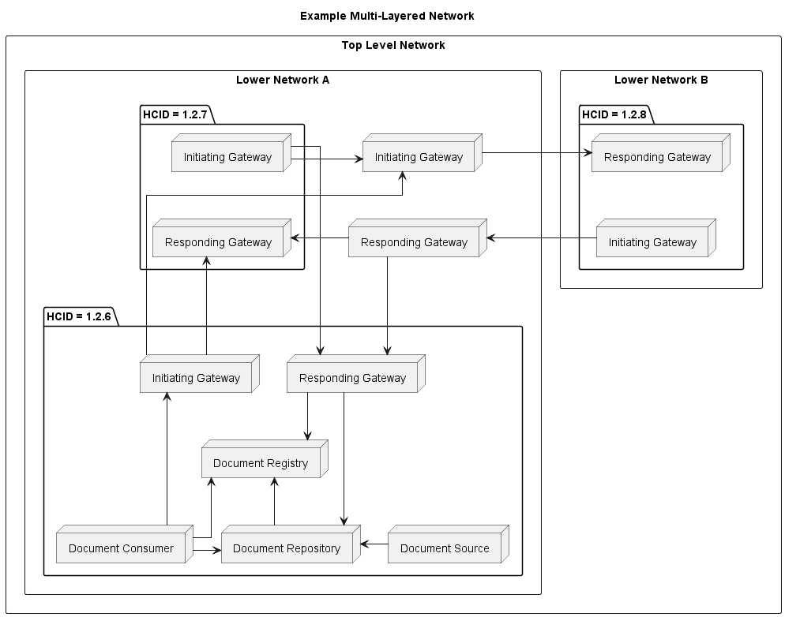

**Figure 1.3-1: Example Multi-Layered Network**

### Document Sharing Federation

**Document Sharing Federation** refers to the act of architecting a document sharing network such that actors within the network exchange healthcare documents directly with one another rather than through a central actor. 
Since there is no central actor that facilitates exchange, the network actors must join together to form a larger entity - the document sharing network. 
In this model, the removal of any actor from the network is subtractive - the network has lost the information made available by that actor. 

In contrast, a centralized network has a set of central actors that aggregate information, and a set of ancillary actors that communicate with the central actors. 
In this contrasting model, the removal of ancillary actors does not subtract from the information available in the network, since that information remains available in the central actors. 

Federation can occur at any layer of a multi-layered document sharing network, though it becomes more likely as higher and higher layers are added, because centralization becomes cumbersome as the network topological depth increases. 

### Care Services Directory

A **Care Services Directory** is a common, authoritative registry of the healthcare organizations, locations, practitioners, etc. and their contact information (both electronic and otherwise). 
A document sharing network, at minimum, needs a directory that contains the set of organizations that are members of the network and the communication endpoints for document sharing. 
More advanced networks will also want to have information about the network topology in the directory, as well as information about the healthcare locations, practitioners, jurisdictions, services, and organizational business relationships. 
Such a directory is likely to serve as a central network directory for a network.

IHE offers the [Mobile Care Services Directory (mCSD)](https://profiles.ihe.net/ITI/mCSD/index.html) Profile to specify how such a directory should operate, and the [mCSD White Paper](https://profiles.ihe.net/ITI/papers/mCSD/index.html) offers additional explanation on how the mCSD Profile can be implemented to solve the business needs of a healthcare information exchange. 

### Patient Identity Management/Linking

In order to successfully and safely exchange patient health information within and across document sharing communities and networks, it is imperative that the parties doing the exchange are able to establish agreement about the patient that is the subject of their communication. 

The concepts and profiles discussed in Section 5 of the [HIE White Paper](https://profiles.ihe.net/ITI/HIE-Whitepaper/index.html#5-patient-identity-management) can be successfully applied across communities and networks.
An important note is that in cases where interaction with network gateways that represent multiple communities is needed, only the XCPD Profile currently offers the functionality needed to give systems outside of the network access to patient identities for each community within the network. 
Other IHE profiles, such as the PDQ family of profiles, do not allow distinguishing between different identities across different communities, and so would only be sufficient when interacting with gateways that represent a single community or offer the facade of a single community.

### Query and Retrieve

**Document Query and Retrieve** refers to a document sharing model where documents are exchanged in a two step process. 
In the first step, the document consumer actor sends a request for a list of available documents. 
In the second step, the document consumer actor reviews the obtained list of documents and retrieves certain documents from the list. 

This model is often referred to as the "pull" model. 
It is generally used in situations where the actors consuming the document need to be able to search and retrieve information about a patient. 
This is most often the case for end user stories that involve reviewing the medical history, or current medical chart, for the patient. 

Document Query and Retrieve is enabled by the [XCA](https://profiles.ihe.net/ITI/TF/Volume1/ch-18.html) Profile in a network setting, but can also be enabled by the [MHD](https://profiles.ihe.net/ITI/MHD/index.html) Profile. 

### Message Delivery

**Message Delivery** refers to a document sharing model where an information source wants to communicate healthcare information to a particular, intended recipient. 
In this model, documents are prepared by the source and then need to be communicated and routed to a recipient that consumes them directly. 

This model can be thought of as a direct replacement for email, fax, postal mail, etc. and is often referred to as a "push" model.

Message Delivery is enabled by the [XDR](https://profiles.ihe.net/ITI/TF/Volume1/ch-15.html), [MHD](https://profiles.ihe.net/ITI/TF/Volume1/ch-33.html), and [XCDR](https://profiles.ihe.net/ITI/TF/Volume1/ch-40.html) Profiles. 

### Translation Capabilities

When a community or network is being constructed in a completely greenfield space, ie, one that does not have any existing technology to reconcile with, a single information exchange standard can be chosen such that all systems seamlessly and natively interoperate with each other.
However, when existing networks become interconnected, and as old systems are replaced with new systems, there will eventually be a need to be able to translate between different communication standards. 
This might mean translating between different IHE integration profiles, such as XCA and the FHIR based MHD profiles, between proprietary data exchange formats and standard formats, or between formats offered by different standards bodies, such as HL7 FHIR IPA and IHE MHD+CDA documents. 

One of IHE's general principles is to describe interactions between systems and to avoid specifying implementations within systems. 
This design principle lends itself well to translation, since it means that as long as the interface exposed by the translating system fully conforms to the relevant IHE integration profile, other systems implementing the other ends of those profiles will be able to interoperate without even realizing that translation is taking place. 

One of the primary use cases of the IHE MHD integration profile is to act as a translation layer between FHIR based systems and systems that implement IHE's XDS family of integration profiles. 
Therefore, IHE has already done the work of mapping the MHD elements to their XDS equivalents, making translation between MHD and XD* profiles exceptionally natural. 

Translation will generally be added to networks in the gateways. 
The gateways will expose one set of interfaces to the systems inside of the network, and a separate set of interfaces to systems outside of the network. 
They might even expose multiple functionally sets of interfaces inside or outside of the network, in order to offer a choice to the systems they must communicate with around which communication protocols can be used. 

Example: Community A exposes two endpoints on its Responding Gateway: XCA and MHD. 
The community is implemented as an XDS Affinity Domain internally, so the MHD interface must translate between XDS and MHD messages. 
Systems outside of the community can use either endpoint, depending on their communication preferences, and in both cases the same set of documents are returned from the internal XDS Affinity Domain. 

Example: Community B exposes an XCA endpoint to the rest of the network it is a part of, according to network governance. Internally, Community B contains a mix of systems that use XDS.b and MHD. 
The XCA Responding Gateway of Community B is grouped with XDS.b and MHD Document Consumers, so that it can accept requests from outside of the community and federate them among the internal systems that contain data being searched for. 
Once it receives responses from all systems, it must translate those responses into an XCA response to meet the network expectations. 
It will do so in a way that is transparent, such that actors outside of the community are not aware of the mixed architecture of the community. 

### Facade Community

Rather than expose internal networks and communities directly, a network could be designed to expose a single facade community to other networks with which it is interconnected.
Such a community would have a single Home Community ID, different from those of the internal communities. 
The network gateways would therefore be responsible for aggregating information from all of the systems within, in order to appear as a single cohesive community to the outside. 

A network offering a facade community must be able to act as a single community for all interactions. 
It must maintain a patient identity cross reference manager, so that patient identities across the internal communities can be aggregated into a single patient identity in the facade community.
When it receives a document list query, it must be able to forward that query to all communities that are part of the facade, and aggregate the responses into a single unified response. 
When it receives a message for delivery, it must be able to route the message to the appropriate community without using a home community id. 

The advantages of such an architecture is that it offers a simplified mechanism for interacting with the network for systems outside of the network, at the cost of complicating the network architecture. 

# 2 Federation Use Cases

## Document Access

In the Document Access use case, a user with a legitimate need to access healthcare information, such as a member of a patient's treatment team, wants to discover all available healthcare information for a patient and review information that they find most pertinent. 
Consider the following scenario:

Dr. Suwati is a primary care physician that works for New Hope Medical Partners. 
Her new patient, Vanna Patterson, recently moved to the area from across the country. 
Before moving, Vanna had been undergoing cancer treatment for about 9 months at several healthcare organizations. 
Since she lived in a rural town, her old primary care physician worked for a small community health center - Valley Access Healthcare. 
Meanwhile, she received her specialty oncology care from a larger, academic health system - University Health. 
To complicate matters, University Health had completed a re-branding 4 month's prior, right in the middle of Vanna's treatment, which means any healthcare summary documents generated prior will have the organization's old name. 
While they are different healthcare organizations, Valley Access Healthcare and University Health do belong to the same regional HIE. 

Dr. Suwati will be taking over as Vanna's new primary care physician, and wants to understand the history and progression of Vanna's disease and the treatment she has undergone thus far. 
Dr. Suwati has listened to Vanna recount the care she has received, and now Dr. Suwati would like to review her medical records to gain clarity from the physician point of view. 
While recounting her medical journey, Vanna described most of the care she received in the context of the organization where she received it, and Dr. Suwati would like to be able to correlate Vanna's story with her medical record. 

Dr. Suwati requests her EHR to find all available medical records for Vanna using Vanna's patient demographics. 
The EHR searches other communities for patients with Vanna's demographics and, once matching patients are found, queries for the documents that make up Vanna's chart. 
Dr. Suwati also finds that additional records were found at Urgent Health. 
Those documents mentioned that Vanna had had a severe reaction to some medication she had been prescribed, such that Vanna should not be prescribed that medication again.
Vanna hadn't mentioned that she was seen at Urgent Health, so Dr. Suwati is grateful that the records were located automatically. 
In order to help organize the documents, Dr. Suwati requests her EHR to sort the documents by date and group by source healthcare organization. 
Dr. Suwati is not concerned with University Health's recent rebranding, she wants to see all of the documents available from that organization throughout history to gain an overview of Vanna's specialty care. 

To meet Dr. Suwati's needs, the EHR needs to be able to programmatically broadcast a set of patient discovery requests to other communities, evaluate the responses and follow-up with queries for medical documents, and then correlate the medical documents by discrete Organization.
In order to respond quickly enough for Dr. Suwati's busy schedule, all of this needs to happen efficiently, and without actually retrieving or parsing the contents of all of the documents that were found.  

## Message Delivery

In the Message Delivery use case, a user has a message that they want to convey to a particular recipient in another, potentially far away, community. 
The destination recipient might be an individual, a department at a healthcare organization, or other such addressable entity. 
The user might have a particular recipient in mind for which they need to discover connectivity, or they might need to be able to discover available recipients. 
Consider the following scenario:

Dr. Suwati has a patient, Leon Sanford, that has a rare neurological disorder that Dr. Suwati is unfamiliar with. 
However, Dr. Suwati knows that University Health, on the other side of the country, has a strong reputation for treating patients with this disorder. 
Dr. Suwati wants to refer Leon to a neurologist at University Health for evaluation. 
She needs to use her EHR to search the central network directory for a list of providers that offer neurological services at University Health, and are currently accepting new patients. 
She reviews the list of providers with Leon and together they determine that Dr. Santos is the best fit for Leon.

Dr. Suwati prepares a referral order and a letter in which she details her treatment of Leon thus far and the concerns she has for Dr. Santos to review. 
Dr. Suwati requests her EHR to send the referral, the letter, and a summary of care document to Dr. Santos at University Health. 

University health is located in another document sharing community, but there is a communication path between New Hope Medical Partners and University Health. 
The EHR needs to be able to send a message that will be received by the community to which University Health is a member and confirm that the message was delivered to Dr. Santos at University Health. 

# 3 Example Network Topologies

This white paper does not specify or endorse any particular network topology. Instead, it recommends the use of standard exchange interfaces at the network gateway level, so that when networks must be interconnected, they can be regardless of topology. What follows are possible example network topologies:

## Single Organization Community

It is possible for a singleton organization to form a community by itself, and for that community to interface directly with other networks. 

The following example shows Home Community 1.2.3, architected as a single XDS Affinity Domain that is completely controlled by Organization ABC.

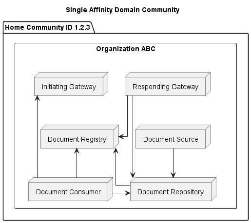

**Figure 1.3-1: Single Organization Community Layout**

## Multi-Organization Community

Multiple organizations can also join together into a community. In this case, querying the community responding gateway will return results for data produced by both organizations. 

The below example shows one such topology, where two organizations have chosen to belong to the same XDS Affinity Domain and therefore share the same XDS infrastructure. 

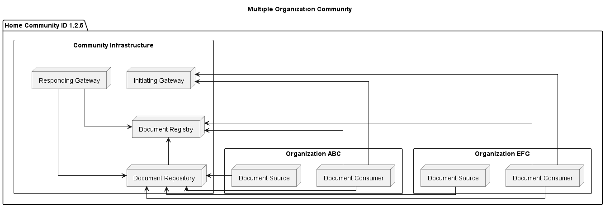
**Figure 1.3-1: Multi-Organization Community Layout**

## Single Facade Community

A community might have a fairly complex architecture internally. It might even be composed of many organizations that exchange data using proprietary mechanisms. However, if the community exposes gateways that are able to abstract away the internal complexities and expose data in the form of documents, then it can successfully act as a node in a multi-layered document sharing network.

In this example, a community is made up of three organizations that exchange data using proprietary methods. The Responding Gateway includes functionality to access this data and generates documents on-demand that can be shared with others in the network. As such, the interface exposed is the same as the single affinity domain case, even though the internal architecture is quite different!

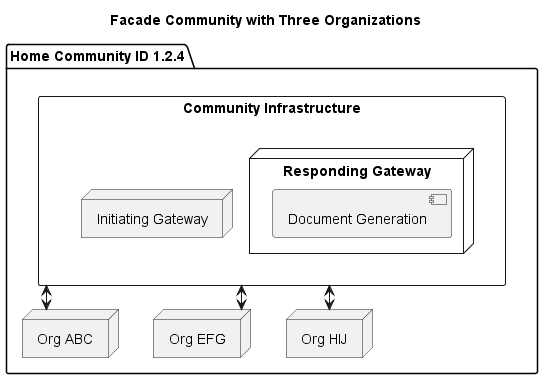

**Figure 1.3-1: Single Facade Community Layout**

## Multiple Community Network

Multiple communities can be joined together to form a network of communities. The network infrastructure can offer initiating and responding gateways that make the internals of the network accessible to other networks. This would allow other networks access to all communities in the network, but they would typically need to interact with one community at a time.

The XCPD integration profile provides a mechanism to query the network with patient demographics with the result being the list of community+patient identifier pairs that have data for the patient. Each community can be queried for data using the patient ID for that community via the network gateway. This is a bit more burdensome on consumers in other networks. If it is desired to interact with the network as if it were a single community, then architecting a facade community might be considered. 

The following diagram shows an example of a multi-community network. The network contains three communities, the inner details of which are not shown:

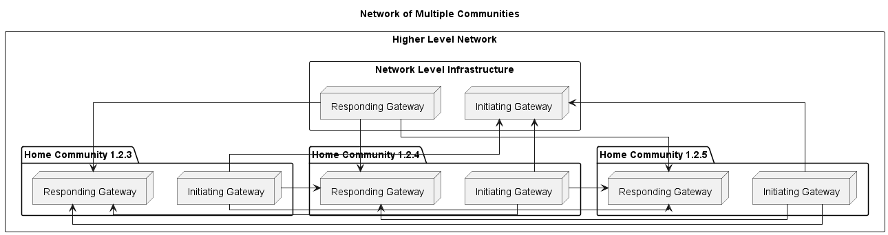

**Figure 1.3-1: Multi-Community Network Layout**

## Multi Layered Network

Similar to a multi-community network, multiple networks can be joined together to form larger, interconnected networks. Similar to multi-community networks, actors external to a multi-layered network can broadcast a patient query into the network and get back a patient identifier for each community within. The patient identifiers can then be used to query for documents. 

By layering networks in this way, the interconnection of different networks can be accomplished in a way that provides a consistent interface for actors both within and outside of each network. 

**Figure 1.3-1: Multi-Layered Network Layout**

# 4 Directory Structure

This section provides guidance on how the above community topologies might be represented in a central network directory. 

## Purpose Built vs Comprehensive Directories

Many current Endpoint directories that are in production at the time of this writing are purpose-built, which is to say they only store information about organization, location, and endpoint information. 
The sole use case of these directories is endpoint lookup, and for this reason, directories often reflect network details directly in the Organization resource, such as:
- The organization's role in the network, like participant or sub-participant, expressed as the type of organization.
- The organization's relationship to its connectivity vendor, expressed as the organization hierarchy (i.e. Organization.partOf in FHIR).
- The organization's connectivity state 
- Supported communication profiles, purposes of use, etc. 
- A single type of organizational identifier, most commonly used as the Home Community ID for IHE cross community integration profiles

The purpose-built nature of these directories makes representation of other organizational hierarchies, such as business relationships and jurisdictional governance, challenging. 
This is because business, jurisdictional, and technical system relationships tend to have organizational hierarchies that do not match one another. 
A directory purpose-built for electronic endpoint exchange tends to prioritize technical system relationships in hierarchical representations, which means that other types of hierarchical relationships are not represented properly. 
This is a significant drawback, as electronic communication information becomes more useful when paired with user facing information.

For example, suppose a clinician works for an organization that contracts out services to several healthcare provider organizations, and that clinician has a specific electronic delivery address for each healthcare provider organization. 
An individual trying to message that clinician about one of their patients would need to understand this well enough to choose the correct delivery address to send their message. 
At the same time, a public health worker might want to be able to quickly identify and message all of the infection disease experts in their government jurisdiction to alert them of a new disease outbreak. 
As expectations of connectedness and automation grow, we predict that it will be necessary to have an increasing amount of information available in a single, centralized directory.
This means that it will be necessary to represent multiple disparate systemic hierarchies in a single directory. 

The IHE mCSD integration profile is well suited to address this problem by utilizing the OrganizationAffiliation resource to provide for the representation of multiple organizational hierarchies, and by also considering how the Practitioner and PractitionerRole resources can be integrated into such a directory. 
This allows for healthcare facilities, care services, healthcare workers, and other healthcare entities to all exist in a central location along with their communication details. 

## Directory Layout Guidance

In this section, we provide guidance on how to represent the example communities introduced in section 3 in a central network directory. 
This guidance will be focused on a central network directory that uses the HL7 FHIR Organization, OrganizationAffiliation, Location, and Endpoint resources to store directory information. The guidance is meant to be compatible with the mCSD integration profile, so that it can live in a directory that has other hierarchical relationships without conflict. 

### FHIR Resources Used For Communication Information

The first question that is asked when document sharing is "what are the parties to the exchange?" 
This question implies the use of the Organization Resource to model the entities exchanging data. 
An Organization is a group of people or organizations that form some collective of action, such as companies, institutions, corporations, departments, community groups, healthcare practice groups, healthcare payers, etc. 
Organizations often exist in one or more hierarchies, where those hierarchies might represent business entity relationships, jurisdictional relationships, IT relationships, etc. 
Organizations have a few key attributes that are relevant for Document Sharing:

* A logical Identifier that uniquely identifies the Organization as an entity
* The Name by which a human user would know of the organization
* Telecom information that can be used to reach the Organization
* Information about what larger Organization the Organization might be part of
* One or more endpoints for electronic communication and data exchange

As stated above, an Organization might belong to a variety of hierarchies for different purposes. 
While the Organization Resource can only refer to one parent Organization directly, the OrganizationAffiliation Resource can be used to establish additional hierarchies. 
The partOf element is typically used to represent business relationships (Department X is part of Organization Y which is a subsidiary of Organization Z), however, some directories might choose to use partOf to also represent document sharing access. 
The OrganizationAffiliation Resource establishes a parent-child relationship via its organization (parent) and participatingOrganization (child) elements. 
It also has a code element that can be used to identify the nature of the relationship between organization and participatingOrganization. 
mCSD defines a code - DocShare-federate - to imply that a parent organization provides access to documents for its children in a Document Sharing Network, and additional codes might be defined by mCSD in the future or by directory policy. 
OrganizationAffiliation also has an endpoint element.
This can be used instead of Organization.Endpoint when it needs to be clear that while the Endpoint is child Organization specific, it is configured by the parent organization. 
This understanding is necessary when there are multiple affiliated parent Organizations that provide child specific endpoints to a particular child Organization, or when the parent organization is the one managing trust relationships for the Endpoint despite the Endpoint serving a single child organization. 

The third Resource that is critical to establishing connectivity is the Endpoint resource. 
An Organization can have one or more Endpoints to represent an access point for electronic communication with that Organization. 
Endpoints have a connectionType that define the type of communication enabled by that endpoint. 
For IHE Document Sharing profiles, mCSD defines an extension - Endpoint Specific Type - to help clarify more information that is needed about the types of messages that the Endpoint can process. 
An Organization is likely to point to multiple Endpoint resources - one for each connectionType/specific type that the organization is able to accommodate. 
Endpoints have an address that contains the technical address to which communication should be directed (most often an HTTPS URL).
Endpoints are pointed at by their respective Organizations, but they also have a managingOrganization element that can be used to identify the Organization that manages (provides support) for the endpoint. 
While the managingOrganization is often in directories and is important for operational support, it generally will not be directly used in Document Sharing since it does not represent a relationship relevant for data access.

Location Resources describe a physical place where services are provided. 
They are similar to Organization in that they have logical identifiers, names, telecom information, a hierarchy, and electronic data exchange Endpoints. 
However, since they represent a physical place, rather than the actual entity that might provide services or maintain IT infrastructure, they are typically not used in Document Sharing outside of facilitating discovery of the Organization that a user desires to share with. 

Finally, the Practitioner and PractitionerRole Resources provide information about individual Practitioners that practice at an Organization. 
They are relevant to DocumentSharing in that they will commonly be referenced in documents and their metadata, but they are also relevant for message delivery use cases in the event a message needs to be delivered to an individual. 

### Indicating Document Sharing Connectivity

Document Sharing relationships might be expressed in the directory via Organization.partOf or by use of the OrganizationAffiliation Resource.

Organization.partOf is the simplest way to represent a relationship between two Organizations.
When child organizations have a partOf relationship with a parent, there is ambiguity around whether requesting data from, or delivering messages to, the parent organization will return data from, or route the message to, the child organizations. 
Alternatively, mCSD supplies an OrganizationAffiliation.code - DocShare-federate - that can be used on an OrganizationAffiliation Resource to explicitly declare that a parent provides document sharing access to a child organization. 
The DocShare-federate code implies that children are accessible for all document sharing technologies supported by the parent; there is no way to declare that the parent endpoints will work for document query and retrieve but not message delivery, for example. 
mCSD might declare a more granular set of OrganizationAffiliation codes in the future to help facilitate this level of nuance.

Because the use of partOf is not explicit in whether it signifies that a parent Organization provides document sharing access to its children, directory policy will need to clarify the meaning of partOf with respect to Document Sharing. 
Possible clarifications would include:
- Declaring that partOf shall be used to signify a Document Sharing relationship rather than or in addition to business relationships.
In this case, OrganizationAffiliation might not be used, but this case is also the most restrictive in preventing the directory from acquiring new, more comprehensive data sets in the future. 
- Declaring that partOf may indicate that the parent provides Document Sharing Access, but only if the child Organization in question has no Endpoints of its own and no OrganizationAffiliation resources with it as a participatingOrganization and a code indicating document sharing access. 
- Declaring that partOf has no relationship to document sharing and any organizations that provide document sharing access to children must be linked to the children with an OrganizationAffiliation with an appropriate code. 
This is the most explicit policy, but one that might be operationally cumbersome to maintain. 

In all three cases, the Endpoint Discovery Algorithm in section below will identify a suitable endpoint if one exists. 
However, it might be ambiguous whether a particular child organization can have data retrieved through its parent when partOf is used and both the child and the parent have endpoints, or when children are in the directory for informational purposes and do not actually have document sharing available. 

### Example Community Directory Layouts

#### Single Organization Community

In a Single Organization Community, the Community can be represented as a single Organization resource with an Organization identifier and a Home Community ID, and these identifiers might even be the same. 
Since the Community's Responding Gateway serves a single Organization, Endpoints for each service provided by the Responding Gateway can be tied directly to the Organization resource, using the Organization.endpoint element. 

An Organization might manage its own Endpoint. 
This results the the simplest case shown below:

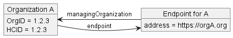

**Figure 1:46.8.1-1: Organization-specific Endpoint Hosted by the Organization**

Suppose instead Organization A is a subsidiary of its parent, B. B provides IT services and support to its subsidiaries, but the subsidiaries have complete control over their endpoints including the data they return and the trust relationships with those that might want access to the endpoint. 
In this case, B would be the managing organization and A is part of B, but the Endpoint is pointed at by Organization A to communicate that the Endpoint is logically "owned by" A:

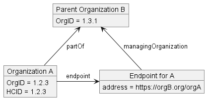

**Figure 1:46.8.1-2: Organization-specific Endpoint Hosted by Parent**

Suppose a similar relationship between organizations C and D, but where D is not a parent organization to C, rather it is a third party affiliate that provides IT services and support. In that case, use of the OrganizationAffiliation resource is more appropriate:

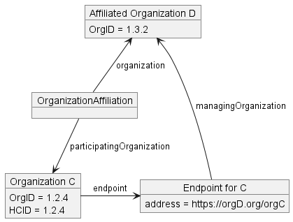

**Figure 1:46.8.1-3: Organization-specific Endpoint Hosted by Affiliation**

Another similar relationship between E and F might exist, but E handles support for other entities on the network. In that case, E is still the managing organization, and F need not be represented in the directory at all:

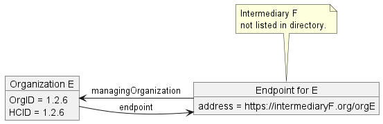

**Figure 1:46.8.1-4: Organization-specific Endpoint Hosted by Unrepresented Intermediary**

Consider another pair of organizations, G and H. H provides document sharing infrastructure services to G by providing G with an endpoint specific to its organization, but H manages the endpoint entirely, including managing trust for outside entities. 
That is to say, outside entities can exchange data with G if they have a trust relationship with H. 

In this case, it is more appropriate to point to the Endpoint for G from the OrganizationAffiliation Resource that connects G and H, to indicate that while the Endpoint provides data for G, it really belongs to H from a trust perspective. 

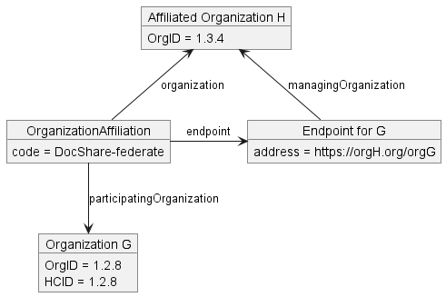

**Figure : Organization-specific Endpoint Controlled by Affiliation**

#### Multiple Paths to an Organization

An organization might be a member of, and reachable by, multiple networks. If each network exposes an Organization specific endpoint to the Organization, then they must list those endpoints on the OrganizationAffiliation Resource, since listing them on the Organization would create ambiguity as to which parent network each endpoint would be used for. 

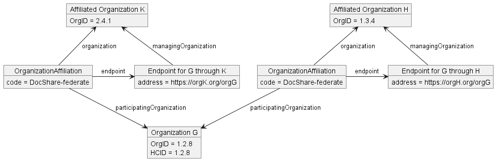

**Figure : Organization-specific Endpoints From Multiple Affiliations**

#### Endpoint to a Structure

It is possible for an organization with an endpoint, such as Organization A, to have other Organizations that point to it via partOf. 
This would be appropriate in the case of subsidiaries or departments within Organization A:

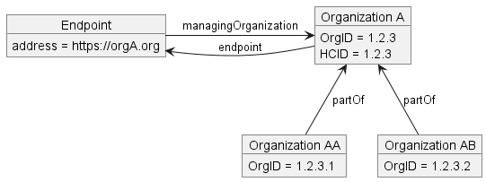

**Figure 1:46.8.2-1: Endpoint to Parent Organization**

Directory policy will determine whether organizational hierarchy via partOf implies accessibility to child entries, for example:
- For FHIR REST endpoints, the URL is simply the Service Base URL as specified in [FHIR R4 3.1.0.1.2](http://hl7.org/fhir/R4/http.html#general). 
Clients can expect to find resources related to Organizations A, B and C.
- For XCA endpoints, a client querying Organization A for documents (e.g., using \[ITI-38\]) may receive documents from Organizations A, B and C. 
- For XDR endpoints, a client sending a Provide and Register Document Set-b (\[ITI-41\]) request to Organization A can optionally specify Organizations B and/or C in intendedRecipient.
- For MHD endpoints, a client sending a Provide Document Bundle (\[ITI-65\]) request to Organization A can optionally specify Organizations B and/or C in intendedRecipient.

Examples of this kind of federated structure are shown in [ITI TF-1: Appendix E.9](https://profiles.ihe.net/ITI/TF/Volume1/ch-E.html#E.9.3), for XCA Responding Gateways.

Because the cardinality of Organization.partOf is 1..1, directories that wish to represent more than one hierarchy, or a non-business hierarchy, might choose to use OrganizationAffiliation to expose those hierarchies instead. 
The following shows the same Organization hierarchy, but using OrganizationAffiliation instead of partOf to declare the relationship:

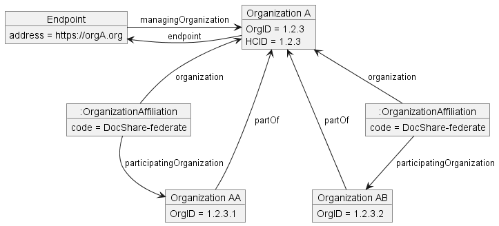

**Figure 1:46.8.2-1: Endpoint to Parent Organization with OrganizationAffiliation**

An OrganizationAffiliation resource without an applicable code would not imply any document sharing connectivity, as OrganizationAffiliation is used for a variety of reasons outside of document sharing. 

Directories that will have Organizations with partOf relationships where both Organizations will have endpoints will likely not want to use partOf to imply connectivity. 
Such networks might be architected in a way that causes the parent organization's Endpoint to not be capable of returning data for the child organization.
Of course, it could also be the case that the parent's Endpoint does return data for the child, but the child's Endpoint is simply more targeted in its scope. 

Because of this, directory policy might dictate that an OrganizationAffiliation Resource should be used to express federated document sharing. 

In such a directory, the below relationship would not imply document sharing federation:

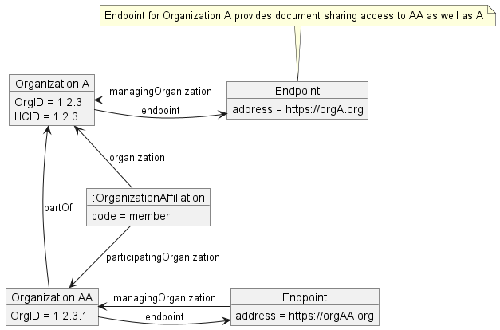

**Figure 1:46.8.2-1: Endpoints to Both Parent and Child Organizations**

If Organization A did provide document sharing access to Organization AA, then an explicit OrganizationAffiliation with a directory defined code would be declared:

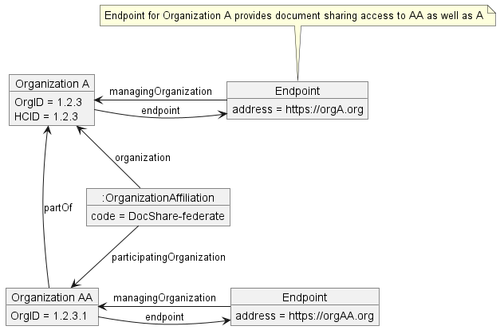

**Figure 1:46.8.2-1: Endpoints to Both Parent and Child Organizations with OrganizationAffiliation**

In a multi-layered network, it is likely that different solutions will be used at different levels. 
Here, Organization G has three subsidiaries, Organizations GA, GB, and GC, as well as a document sharing affiliation with Organization F. 
Organization F's endpoint would provide document sharing access to all four organizations:

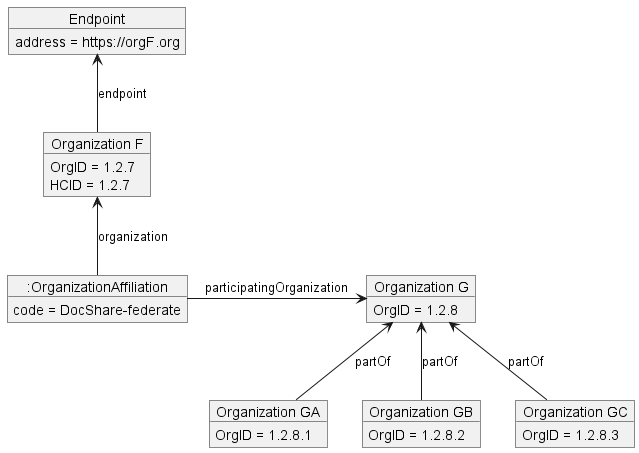

**Figure 1:46.8.2-3: Endpoint to Multi-Layered Organizational Structure**

#### Organizations with Multiple Endpoints

A single Organization might have multiple Endpoints for different purposes. 
For example, endpoints might be needed for IHE XCPD, XCA, XCDR, and a FHIR endpoint to accommodate PDQm and MHD transactions. 

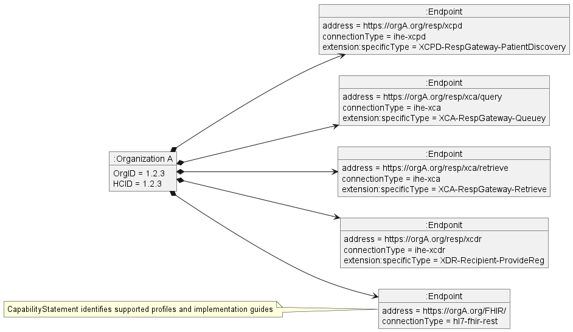

**Figure 1:46.8.3-1: Multiple Endpoints For A Single Organization**

### Endpoint Discovery 

The following example shows the steps used by a Care Services Selective Consumer to navigate a directory to find suitable electronic service Endpoints to a desired Organization. 
A "suitable" Endpoint is one that can provide the service needed by the consumer. 
This typically means it has a connectionType and possibly an endpoint specificType that matches the transaction it wishes to initiate, and an Active status. 
The example uses the mCSD-profiled OrganizationAffiliation that indicates federated connectivity for Document Sharing (e.g., affiliated organizations may be addressed as intendedRecipient). 
The algorithm below uses depth-first search and guarantees that if an endpoint is available, it will be found. 
Implementations might wish to enhance the algorithm to search in alternative ways depending on their deployment environment and path preferences. 
It is also for illustrative purposes only and does not protect against invalid data such as missing elements, hierarchical loops, or other programming hazards. 

#### Endpoint Discovery Algorithm

- Accept as input a desiredOrg - the Organization for which an endpoint is sought
- For each Endpoint in Organization.endpoint
  - If Endpoint meets the desired criteria, the algorithm ends with Endpoint as the result
- Perform a search for OrganizationAffiliation Resources where OrganizationAffiliation.participatingOrganization is currentOrg and OrganizationAffiliation.code indicates the needed document sharing access
- For each OrganizationAffiliation Resource found
  - For each Endpoint in OrganizationAffiliation.endpoint
    - If Endpoint meets the desired criteria, the algorithm ends with Endpoint as the result
  - Execute the Endpoint Discovery Algorithm with OrganizationAffiliation.organization as the desiredOrg
  - If an Endpoint was returned, the algorithm ends with Endpoint as the result
- If Organization.partOf is not null, execute the Endpoint Discovery Algorithm with Organization.partOf as the desiredOrg
- If an Endpoint was returned, the algorithm ends with Endpoint as the result
- Else, the algorithm ends with no result found (null)

#### Endpoint Discovery Considerations
Rather than a first-match search, the Care Services Selective Consumer might search for and decide among multiple electronic paths to the same Organization. For example:
- It finds a suitable Endpoint resource for the target Organization, but instead uses an Endpoint for an Organization two levels higher to make a broader search for records.
- It finds suitable Endpoint resources for equivalent mechanisms, XDR \[ITI-41\] and MHD \[ITI-65\], and chooses MHD as the preferred transaction.
- It finds suitable Endpoint resources to the same Organization via two different HIEs, and prefers one HIE based on lower fees and authorization differences.

Community or Network governance may also choose to place restrictions on the directory layout to ensure that there will be only a single path to any given Organization in order to simplify deployment and operations. 

### Directory Perspective

An important consideration when layering multiple networks is how different entities in the network will perceive the network. Care needs to be taken to ensure that network directories at each level accurately reflect the set of endpoints reachable by those members. For example, consider the multi-layered network diagram:

**Figure 1.3-1: Multi-Layered Network Layout**

Here:

* The community with HCID 1.2.8 is a member of the Top Level Network
* The Lower Network A network is also a member of the Top Level Network
* The community with HCID 1.2.7 is a member of Lower Network A
* The community with HCID 1.2.6 is a member of Lower Network A

The directory for Lower Network A will have endpoints for communities 1.2.7 and 1.2.6, and for the network gateways. The directory for the Top Level Network would need to have communities 1.2.7 and 1.2.6 in it, but it should not hvae their endpoints. This is because their endpoints are only accessible to members of Lower Network A; members of Top Level Network need to access them via the Lower Network A gateways. If the endpoints for 1.2.7 were published in the Top Level Network directory, then the endpoint discovery algorithm from Community 1.2.8's perspective might identify those endpoints, but they would not work for 1.2.8. To resolve this problem, each network directory should have only the endpoints accessible to network members in them. 

### Inclusion of Message Delivery Addresses

A common need in document sharing push workflows is to deliver a message to a specific intended recipient. 
That recipient might be an Organization, a Practitioner, or some other Person or Group. 
Since the intended recipient of a message is often far more specific than the set of entities served by an endpoint, delivering a message to an endpoint is insufficient for message delivery - the recipient also needs to be addressed so that the message can be routed to the intended recipient. 

The IHE document sharing profiles capable of handling push messaging - XDR, XCDR, and MHD - contain a field for intendedRecipient that can be used for such an address. The appropriate value with which to populate intendedRecipient could be determined from the target recipient's entry in the mCSD directory. 
Note:  For Practitioners, the PractitionerRole Resource would be the target resource since a Practitioner might have roles at several organizations, and it is important to deliver the message to the Practitioner at the Organization where the relevant patient care takes place.
There are two elements, common across the FHIR resources that users would typically wish to address, that might be used for such a value:
- PractitionerRole, Location, and Organization Resources have endpoint elements. Endpoint.address can be any URI, so a URI could be constructed for each addressable resource, populated in intendedRecipient, and used by responding gateways for message routing. 
- The above Resources, as well as the Person Resource, have a .telecom element. If these elements are populated with sufficiently unique values (for example, non-shared email addresses), then they could be used to populate intendedRecipient and used by responding gateways for message routing. 

Additional profiling of the above Resources might specify a more standardized way of communicating intendedRecipient addresses in the future. 
In the absence of that profiling, determining how to populate intendedRecipient will be up to community and network policy. 
Networks that wish to enable the Message Delivery use case should ensure that whatever values they select can be used by responding gateways to the actual intended recipient. 

In an environment where suitable intendedRecipient addresses can be determined, a Document Source (or delegated Initiating Gateway) would accomplish Message Delivery by doing the following:
- First, use the Endpoint Discovery Algorithm to find the most localized and suitable Endpoint for Message Delivery to the intended recipient's Organization. 
- Then, compose a message with intendedRecipient populated according to community or network policy, and transmit that message to the discovered Endpoint. 

### Associating Documents With Directory Entries

A common need in document sharing is to attribute a received document to a healthcare organization or provider. 
This can be done discretely with the aid of a centralized directory. 
Both the authorInstitution and authorPerson document sharing metadata elements can contain a discrete identifier for the document's author. 
The corresponding mCSD directory entries will also have a .identifier element that discretely identifies them. 
Therefore, the authorInstitution and authorPerson document sharing metadata elements should be populated with identifiers from the corresponding directory entries to enable correlation. 

Note that Organizational identifiers like Home Community ID or Repository Unique ID are often not unique to a particular Organization and so should not be relied upon to attribute documents to a particular Organization. 

## Examples
In this section we will take the example topologies from above and show how they would be represented in an mCSD directory

### Single Community With Data Aggregator

TODO

### Single Community With Multiple Affinity Domains 

TODO

### Multiple Community Network 

TODO

# 5 Example Use Case Solutions
This section will describe how the use cases in section 2 are enabled by the above suggestions

TODO:  Flesh out

## Document Access 

Let us consider the Document Access use case from section 2, and how the objects could be represented in a directory and utilized based on different topologies.

The example includes four organizations: New Hope Medical Partners, University Health, Valley Access Healthcare, and Urgent Health, as well as a regional HIE, which we’ll call Valley Region HIE. Here are just the organizations and their relationships. For now, we’ll leave any relationship between New Hope and the others unspecified.

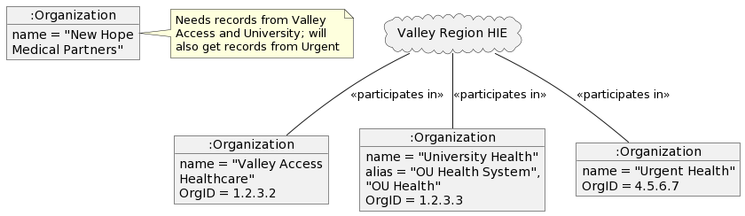

### Intra-community, Central Services Access

In this example, New Hope also belongs to Valley Region HIE, which provides a central service infrastructure that holds all clinical information for all organizations. This deployment is so simple that a purpose-built directory could just list the Organizations and Endpoints as a flat list:

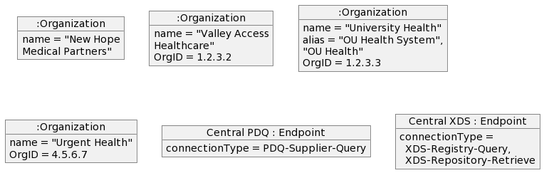

Here’s Dr. Suwati using her EHR to do the search:

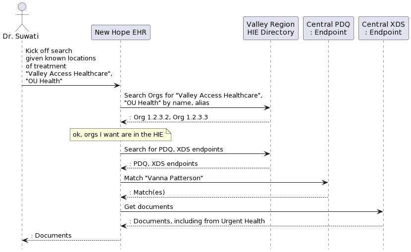

In a slightly more comprehensive directory, there may be other communities with their own Endpoints, so we need a way for members of Valley Region HIE to find their services, and also to know that these services provide access to information from the other organizations in the HIE. We could accomplish this with partOf relationships linking the organizations to the HIE:

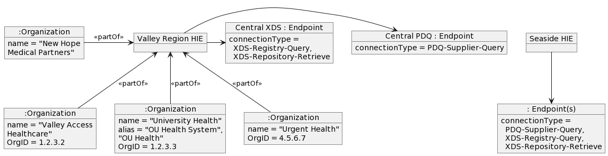

And the search
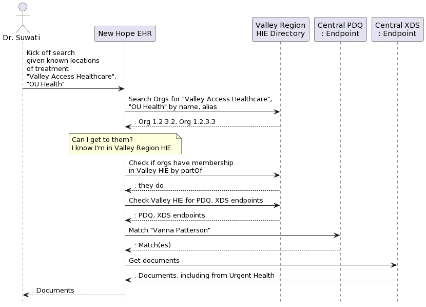

## Message Delivery

TODO

# 6 Miscellaneous

## Further Reading

## Scratchpad
TODO:  This section SHALL be removed prior to public comment

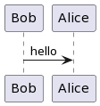

**Figure 1: Diagram**
