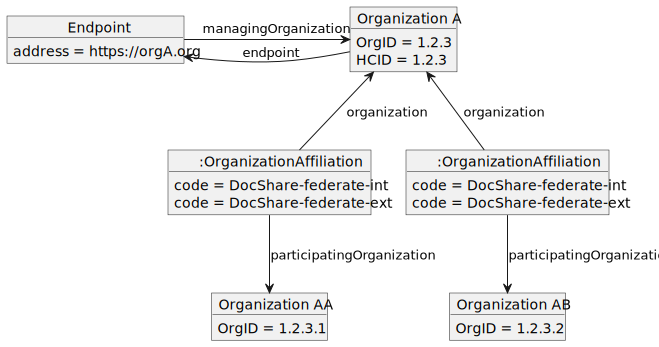
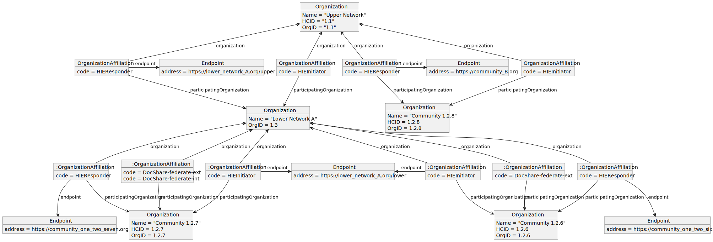
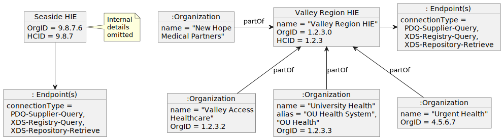
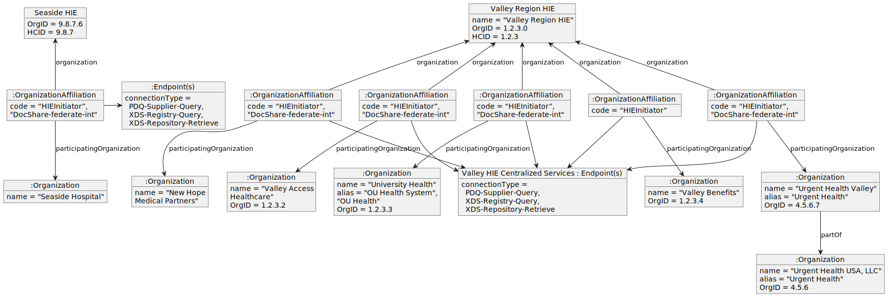
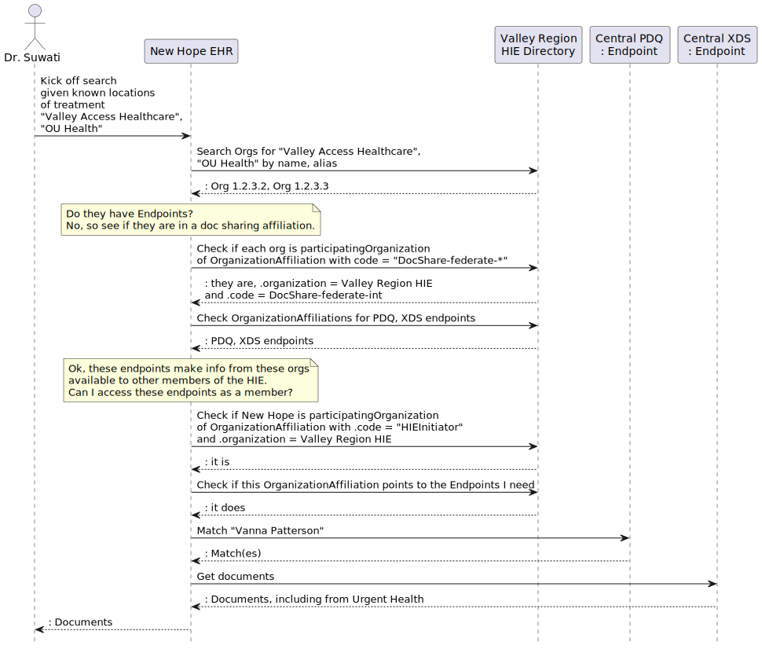
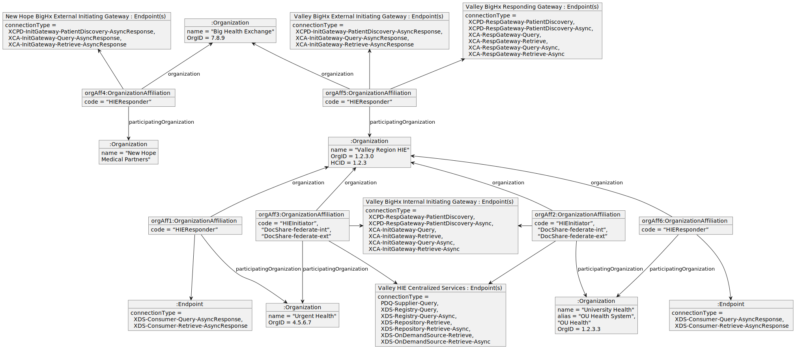

 **Integrating the Healthcare Enterprise**

**[IHE IT Infrastructure (ITI)](https://profiles.ihe.net/ITI) White Paper**

**Document Sharing Across Network Topologies**

**Revision 0.1 - Draft**

Date: February 10, 2023

Author: ITI Technical Committee

Email: iti@ihe.net

**Please verify you have the most recent version of this white paper. See [here](https://profiles.ihe.net/ITI/#1.6) for the Published version and [here](https://profiles.ihe.net/ITI/#1.3) for Public Comment versions.

**Foreword**

This is a white paper to the IHE IT Infrastructure Technical Framework. Each white paper undergoes a process of public comment and publication. IHE white papers are informative and are used to describe or investigate the need for normative publications.

Comments are invited and can be submitted using the [IT Infrastructure Comment Form](http://www.ihe.net/ITI_Public_Comments/) or by creating a [GitHub Issue](https://github.com/IHE/ITI.Topologies/issues/new?assignees=&labels=&template=public-comment-issue-template.md&title=).

General information about IHE can be found at [IHE.net](http://www.ihe.net).

Information about the IHE IT Infrastructure domain can be found at [IHE Domains](https://www.ihe.net/IHE_Domains/).

Information about the organization of IHE Technical Frameworks and Supplements and the process used to create them can be found at [Profiles](https://www.ihe.net/resources/profiles/) and [IHE Process](https://www.ihe.net/about_ihe/ihe_process/).

The current version of the IHE IT Infrastructure Technical Framework can be found at [IT Infrastructure Technical Framework](https://profiles.ihe.net/).

**CONTENTS**

<!-- TOC depthFrom:1 depthTo:2 -->
<!--
- [Introduction to this Supplement](#introduction-to-this-supplement)
- [Open Issues and Question](#open-issues-and-question)
- [Closed Issues](#closed-issues)
- [IHE Technical Frameworks General Introduction](#ihe-technical-frameworks-general-introduction)
	- [9 Copyright Licenses](#9-copyright-licenses)
- [IHE Technical Frameworks General Introduction Appendices](#ihe-technical-frameworks-general-introduction-appendices)
    - [Appendix A - Actor Summary Definitions](#appendix-a---actor-summary-definitions)
	- [Appendix B - Transaction Summary Definitions](#appendix-b---transaction-summary-definitions)
	- [Appendix D - Glossary](#appendix-d---glossary)
- [Volume 1 - Profiles](#volume-1---profiles)
- [34 IUA Profile](#34-iua-profile)
    - [34.1 IUA Actors, Transactions, and Content Modules](#341-iua-actors-transactions-and-content-modules)
    - [34.2 IUA Actor Options](#342-iua-actor-options)
    - [34.3 IUA Required Actor Groupings](#343-iua-required-actor-groupings)
    - [34.4 IUA Overview](#344-iua-overview)
    - [34.5 IUA Security Considerations](#345-iua-security-considerations)
    - [34.6 IUA Cross Profile Considerations](#346-iua-cross-profile-considerations)
- [Volume 2 - Transactions](#volume-2---transactions)
    - [3.71 Get Access Token [ITI-71]](#371-get-access-token-iti-71)
    - [3.72 Incorporate Access Token [ITI-72]](#372-incorporate-access-token-iti-72)
    - [3.102 Introspect Token [ITI-102]](#3102-introspect-token-iti-102)
    - [3.103 Get Authorization Server Metadata [ITI-103]](#3103-get-authorization-server-metadata-iti-103)
- [33 MHD Profile](#33-mhd-profile)
- [9 ATNA Profile](#9-atna-profile)
-->
<!-- /TOC -->

TODO:  Fix

# 1 Introduction

As civilization becomes increasingly connected, it is becoming increasingly important and expected that all stakeholders in a health information ecosystem can access the information they need quickly, seamlessly, and without concern for jurisdictional, geographic, or organizational boundaries. 
To do so requires vast information exchange networks that span entire countries, or ideally, the world. 

The [Integrating the Healthcare Enterprise (IHE)](http://www.ihe.net) standards profiling
organization has previously published a [Health Information Exchange (HIE) White Paper](https://profiles.ihe.net/ITI/HIE-Whitepaper/index.html) that gives an overview of the IHE integration profiles and policy decisions that should be considered when planning the architecture of a document sharing community. 
This white paper expands on the HIE White Paper by exploring strategies for integrating multiple document sharing communities into one federated exchange ecosystem with wide and comprehensive reach at the national or global level. 
Readers are expected to be familiar with the concepts and ideas presented in the HIE White Paper, as those concepts will be used and expanded upon here. 

## 1.1 Scope

The scope of this white paper is to expand upon the ITI HIE White Paper by providing additional guidance on how existing document sharing communities can be interconnected to form a unified federated exchange ecosystem with wide and comprehensive reach. 
This white paper will assume that since existing networks are being connected, document sharing must be federated across the networks, but each network might use either a federated or centralized architecture internally. 
This white paper will not address any topics regarding the creation of a document sharing community or affinity domain. 
Readers interested in those topics are advised to look to the following existing IHE resources:

- [HIE White Paper](https://profiles.ihe.net/ITI/HIE-Whitepaper/index.html)
- [Template for XDS Affinity Domain Deployment Mapping](https://www.ihe.net/Technical_Framework/upload/IHE_ITI_White_Paper_XDS_Affinity_Domain_Template_TI_2008-12-02.pdf)
- [Metadata Handbook](https://profiles.ihe.net/ITI/papers/metadata/index.html) 

While document sharing will be federated across networks, this white paper recommends the use of a centralized directory, likely operated by an entity not part of any of the networks, that aggregates the organizational and business information about all entities in all networks in the directory as well as the technical details needed to facilitate document sharing among them all.
Examples will be based on the [mCSD](https://profiles.ihe.net/ITI/mCSD/index.html) Profile, which offers the functionality needed by such a directory, and also offers a transaction that can be used to synchronize the central directory with directories operated by each network.  

Networks should expose to each other standard interfaces that abstract away their underlying topologies to the greatest extent possible.
Ideally, these would be the same standards based interfaces used to communicate between communities within networks, and this can be accomplished with thoughtful and consistent use of IHE's integration profiles. If this is done well, then introspection into another network is not necessary to facilitate the flow of information. 

That said, there a a few instances where members of one network might need to introspect into another network in order to interpret the information they are receiving.
The two cases this white paper will address are

1. Situations where information received from another network needs to be attributed to a particular organization inside of that network
2. Situations where a message needs to be delivered to a particular recipient within another network

In both of these cases, the centralized directory will be used to correlate identifiers in document sharing messages with Organization Resources in the directory, such that a discrete association can be made programmatically.

In addressing these use cases, this white paper's scope is limited to the exchange of healthcare documents across networks. 
Document exchange provides a good baseline for healthcare data interoperability, as it simplifies exchange by grouping data into documents. 
Document sharing allows for the exchange of both structured data (for example, CDA or FHIR documents) as well as unstructured data (for example, scanned documents, PDF files, etc.). 
This makes document exchange a good choice for establishing baseline data exchange, whereas other forms of exchange, such as search and read of discrete FHIR resources via a RESTful API, are more advanced and can be added to an existing exchange ecosystem once baseline goals are met. 
As such, this white paper focuses only on document sharing, and does not address problems that might arise from other forms of data exchange. 

## 1.2 Intended Audience

The intended audience of this white paper includes those involved in promoting, coordinating, architecting or participating in federated exchange across existing health information sharing networks. 
This paper covers high level data exchange philosophies and architectures, but does not cover implementation details. Such details can be found in the underlying IHE profiles leveraged here. 
Furthermore, the intended audience is assumed to have a strong understanding of document sharing communities and other topics covered in the ITI HIE White Paper. 

Some intended audiences include:

- Those charged with enabling widespread healthcare data exchange
- Health Information Exchange Executives and Architects
- Health-IT Vendor Architects and Developers
- Standards Development Architects
- Academic Health Data Exchange Stakeholders

## 1.3 High Level Concepts

The following concepts and definitions will be used throughout this white paper. 

### Document Sharing Environment

**Document Sharing Environment** refers to any situation where two or more healthcare IT systems are exchanging health information in document format. 
Examples of document sharing environments include but are not limited to document sharing communities and document sharing networks. 

### Document Sharing Community

A **Document Sharing Community** is a group of facilities/enterprises that have agreed to work together using a common set of policies for the purpose of sharing health information within the community via an established mechanism. 

Within each community, there exists a pair of gateways that are used to exchange data across community boundaries. 
The Initiating Gateway is used by members within a community to send messages to actors outside of the community. 
The Responding Gateway is the access point for actors outside of the community to access services within the community. 
These Actors are logically separate, but can be combined into a single system at the discretion of the implementer.

This pattern was established in the [XCPD](https://profiles.ihe.net/ITI/TF/Volume1/ch-27.html) and [XCA](https://profiles.ihe.net/ITI/TF/Volume1/ch-18.html) Profiles, but can be applied to other environments as well.

### Home Community ID

A **Home Community ID** (HCID) is a globally unique identifier for a community. 
Note that in the case where a community contains a single organization, a home community ID will also uniquely identify that organization, but in the general case where a community contains several organizations, the HCID will be distinctly different from individual organization identifiers. 

### Document Sharing Network

A **Document Sharing Network** is defined as a collection of one or more Document Sharing Communities and/or Document Sharing Networks that agree to a common, higher level governance structure, participate in document sharing with one another, and share network central resources, such as a central network directory, among one another. 

Document Sharing Networks might provide their participant communities with a variety of services. 
The most common are centralized directories, certificate authorities, and centralized network gateways. 

### Network Gateway

A **Network Gateway** is a system, central to a given network, that facilitates data exchange across network boundaries. 
The Initiating Gateway is used by participants within a network to send messages to actors belonging to other networks. 
The Responding Gateway is the access point for actors belonging to other networks to access services within the network.

Network Gateways expose the same interfaces and are interacted with in the same way as community gateways. The difference is that a Network Gateway might provide access to several communities. 
Therefore, where network gateways are used, participants can interact with the network gateway in the same way as a community gateway, with the caveat that the network gateway might process information for several Home Community IDs. 

### Transparent Proxy

A **Transparent Proxy** is similar to a network gateway in that it brokers access across network boundaries. However, it is different in that a Transparent Proxy has no internal business logic - it exists solely to broker trust across the network boundary, and possibly provide translation services. 

For example, suppose network 1 exists and is running smoothly, with trust between nodes being managed by a Certificate Authority internal to the network. However, that network then wants to join a higher level network, network 2, so its participants get access to the participants of the higher level, and vice versa. In order to ease the burden of federating trust across the multiple networks, network 1 might introduce a transparent proxy into its infrastructure. That proxy would trust, and be trusted by, the members of network 1, and also the other members of the higher level network 2. The transparent proxy would simply forward requests and responses in both directions across the network boundary, accessing network 1 on behalf of network 2, and network 2 on behalf of network 1. 

A transparent proxy need not be represented in a directory, because systems on the network will not necessarily be aware of its existence. From their perspective, they are talking directly to the system behind the proxy, thus why the proxy is "transparent". 

### Central Network Directory

Systems in a network require a method for discovering one another. 
For large networks, manual configuration is not feasible, so discovery needs to be automated. 
Discovery can be facilitated by the addition of a central network directory into a network. 

A central network directory is a care services directory that is central to the network and thus does not have bias toward one segment of the network or another. 

In a multi-layered document sharing network, central directories for different layers of the network are likely to synchronize partially or entirely with one another in order to provide other layers of the network visibility into the Organizations present outside of their immediate network. 

### Multi-Layered Document Sharing Network

A **Multi-Layered Document Sharing Network** is a document sharing network that contains other document sharing networks as members. That is to say, such a network is a "network of networks". 

For the sake of clarity, this white paper will refer to the most atomic actors in a multi-layered network as the "bottom" layers, and the least atomic actors as the "top" layers. 

**Figure 1.3-1: Example Multi-Layered Network**

### Document Sharing Federation

**Document Sharing Federation** refers to the act of architecting a document sharing network such that actors within the network exchange healthcare documents directly with one another rather than through a central actor. 
Since there is no central actor that facilitates exchange, the network actors must join together to form a larger entity - the document sharing network. 
In this model, the removal of any actor from the network is subtractive - the network has lost the information made available by that actor. 

In contrast, a centralized network has a set of central actors that aggregate information, and a set of ancillary actors that communicate with the central actors. 
In this contrasting model, the removal of ancillary actors does not subtract from the information available in the network, since that information remains available in the central actors. 

Federation can occur at any layer of a multi-layered document sharing network, though it becomes more likely as higher and higher layers are added, because centralization becomes cumbersome as the network topological depth increases. 

### Care Services Directory

A **Care Services Directory** is a common, authoritative registry of the healthcare organizations, locations, practitioners, etc. and their contact information (both electronic and otherwise). 
A document sharing network, at minimum, needs a directory that contains the set of organizations that are members of the network and the communication endpoints for document sharing. 
More advanced networks will also want to have information about the network topology in the directory, as well as information about the healthcare locations, practitioners, jurisdictions, services, and organizational business relationships. 
Such a directory is likely to serve as a central network directory for a network.

IHE offers the [Mobile Care Services Directory (mCSD)](https://profiles.ihe.net/ITI/mCSD/index.html) Profile to specify how such a directory should operate, and the [mCSD White Paper](https://profiles.ihe.net/ITI/papers/mCSD/index.html) offers additional explanation on how the mCSD Profile can be implemented to solve the business needs of a healthcare information exchange. 

### Patient Identity Management/Linking

In order to successfully and safely exchange patient health information within and across document sharing communities and networks, it is imperative that the parties doing the exchange are able to establish agreement about the patient that is the subject of their communication. 

The concepts and profiles discussed in Section 5 of the [HIE White Paper](https://profiles.ihe.net/ITI/HIE-Whitepaper/index.html#5-patient-identity-management) can be successfully applied across communities and networks.
An important note is that in cases where interaction with network gateways that represent multiple communities is needed, only the XCPD Profile currently offers the functionality needed to give systems outside of the network access to patient identities for each community within the network. 
Other IHE profiles, such as the PDQ family of profiles, do not allow distinguishing between different identities across different communities, and so would only be sufficient when interacting with gateways that represent a single community or offer the facade of a single community.

### Query and Retrieve

**Document Query and Retrieve** refers to a document sharing model where documents are exchanged in a two step process. 
In the first step, the document consumer actor sends a request for a list of available documents. 
In the second step, the document consumer actor reviews the obtained list of documents and retrieves certain documents from the list. 

This model is often referred to as the "pull" model. 
It is generally used in situations where the actors consuming the document need to be able to search and retrieve information about a patient. 
This is most often the case for end user stories that involve reviewing the medical history, or current medical chart, for the patient. 

Document Query and Retrieve is enabled by the [XCA](https://profiles.ihe.net/ITI/TF/Volume1/ch-18.html) Profile in a network setting, but can also be enabled by the [MHD](https://profiles.ihe.net/ITI/MHD/index.html) Profile. 

### Push Model

**Push Model** or simply "push" refers to a document sharing model where an information source wants to communicate healthcare information to a particular intended recipient. 
In this model, documents are prepared by the source and then need to be communicated and routed to a recipient that consumes them directly. 

This model can be thought of as a direct replacement for email, fax, postal mail, etc. and is often referred to as a "push" model.

Push is enabled by the [XDR](https://profiles.ihe.net/ITI/TF/Volume1/ch-15.html), [MHD](https://profiles.ihe.net/ITI/TF/Volume1/ch-33.html), and [XCDR](https://profiles.ihe.net/ITI/TF/Volume1/ch-40.html) Profiles. 

### Translation Capabilities

When a community or network is being constructed in a completely greenfield space, ie, one that does not have any existing technology to reconcile with, a single information exchange standard can be chosen such that all systems seamlessly and natively interoperate with each other.
However, when existing networks become interconnected, and as old systems are replaced with new systems, there will eventually be a need to be able to translate between different communication standards. 
This might mean translating between different IHE integration profiles, such as XCA and the FHIR based MHD profiles, between proprietary data exchange formats and standard formats, or between formats offered by different standards bodies, such as HL7 FHIR IPS and IHE MHD+CDA documents. 

One of IHE's general principles is to describe interactions between systems and to avoid specifying implementations within systems. 
This design principle lends itself well to translation, since it means that as long as the interface exposed by the translating system fully conforms to the relevant IHE integration profile, other systems implementing the other ends of those profiles will be able to interoperate without even realizing that translation is taking place. 

One of the primary use cases of the IHE MHD integration profile is to act as a translation layer between FHIR based systems and systems that implement IHE's XDS family of integration profiles. 
Therefore, IHE has already done the work of mapping the MHD elements to their XDS equivalents, making translation between MHD and XD* profiles exceptionally natural. 

Translation will generally be added to networks in the gateways. 
The gateways will expose one set of interfaces to the systems inside of the network, and a separate set of interfaces to systems outside of the network. 
They might even expose multiple sets of interfaces inside or outside of the network, in order to offer a choice to the systems they must communicate with around which communication protocols can be used. 

Example: Community A exposes two endpoints on its Responding Gateway: XCA and MHD. 
The community is implemented as an XDS Affinity Domain internally, so the MHD interface must translate between XDS and MHD messages. 
Systems outside of the community can use either endpoint, depending on their communication preferences, and in both cases the same set of documents are returned from the internal XDS Affinity Domain. 

Example: Community B exposes an XCA endpoint to the rest of the network it is a part of, according to network governance. Internally, Community B contains a mix of systems that use XDS.b and MHD. 
The XCA Responding Gateway of Community B is grouped with XDS.b and MHD Document Consumers, so that it can accept requests from outside of the community and federate them among the internal systems that contain data being searched for. 
Once it receives responses from all systems, it must translate those responses into an XCA response to meet the network expectations. 
It will do so in a way that is transparent, such that actors outside of the community are not aware of the mixed architecture within the community. 

### Facade Community

Rather than expose internal networks and communities directly, a network could be designed to expose a single facade community to other networks with which it is interconnected.
Such a community would have a single Home Community ID, different from those of the internal communities. 
The network gateways would therefore be responsible for aggregating information from all of the systems within, in order to appear as a single cohesive community to the outside. 

A network offering a facade community must be able to act as a single community for all interactions. 
It must maintain a patient identity cross reference manager, so that patient identities across the internal communities can be aggregated into a single patient identity in the facade community.
When it receives a document list query, it must be able to forward that query to all communities that are part of the facade, and aggregate the responses into a single unified response. 
When it receives a message for delivery, it must be able to route the message to the appropriate community without using a home community id. 

The advantages of such an architecture is that it offers a simplified mechanism for interacting with the network for systems outside of the network, at the cost of complicating the network architecture. 

## 1.4 Community vs Network vs Multi-Layered Network

The concepts of Community, Network, and Multi-Layered network are very similar in concept, so it is important to distinguish how those terms are used here. 

A **community** is distinguished as an entity that provides infrastructure to allow access to healthcare data internally, and provide internal systems access to external communities. 
A community is always assigned a Home Community ID that can be used to address the community in document sharing. 

A document sharing **network** is distinguished as a group of entities with shared governance that agree on data sharing policies and technologies. 
A network will typically have some amount of central infrastructure. 
Common central components might include a Certificate Authority for facilitating authentication between network members, a central directory for facilitating network membership discovery, and initiating and responding gateways for federating exchange inside and outside of the network. 
A community inherently meets this definition, so all communities are networks, but not all networks are communities. 
A network might not be assigned its own Home Community ID in the case where it does not provide any services that require addressing the network as a whole. 

Consider a network that consists of two separate communities. The network might contain initiating and responding gateways, but if the network delegates patient matching to both communities, and forces other requests to address a single one of the communities, it would not typically be seen as its own community. 

A **multi-layered-network** is simply a network that contains other networks within. A multi-layered network is itself a general network, but is distinguished by the fact that it consists of policy agreements and communication infrastructure to facilitate communication across different entities that themselves can operate independently as networks. 

**Figure 1.3-1: Comparison of Community, Network, and Multi-Layer Network**

# 2 Federation Use Cases

## Document Access

### User Story

In the Document Access use case, a user with a legitimate need to access healthcare information, such as a member of a patient's treatment team, wants to discover all available healthcare information for a patient and review information that they find most pertinent. 
Consider the following scenario:

Dr. Suwati is a primary care physician that works for New Hope Medical Partners. 
Her new patient, Vanna Patterson, recently moved to the area from across the country. 
Before moving, Vanna had been undergoing cancer treatment for about 9 months at several healthcare organizations. 
Since she lived in a rural town, her old primary care physician worked for a small community health center - Valley Access Healthcare. 
Meanwhile, she received her specialty oncology care from a larger, academic health system - University Health. 
To complicate matters, University Health had completed a re-branding 4 month's prior, right in the middle of Vanna's treatment, which means any healthcare summary documents generated prior will have the organization's old name. 
While they are different healthcare organizations, Valley Access Healthcare and University Health do belong to the same regional HIE. 

Dr. Suwati will be taking over as Vanna's new primary care physician, and wants to understand the history and progression of Vanna's disease and the treatment she has undergone thus far. 
Dr. Suwati has listened to Vanna recount the care she has received, and now Dr. Suwati would like to review her medical records to gain clarity from the physician point of view. 
While recounting her medical journey, Vanna described most of the care she received in the context of the organization where she received it, and Dr. Suwati would like to be able to correlate Vanna's story with her medical record. 

Dr. Suwati requests her EHR to find all available medical records for Vanna using Vanna's patient demographics. 
The EHR searches other communities for patients with Vanna's demographics and, once matching patients are found, queries for the documents that make up Vanna's chart. 
Fortunately, Dr. Suwati was able to find Vanna's medical records at Valley Access Healthcare and University Health. 
However, she also finds that additional records were found at Urgent Health. 
Those documents mentioned that Vanna had had a severe reaction to some medication she had been prescribed, such that Vanna should not be prescribed that medication again.
Vanna hadn't mentioned that she was seen at Urgent Health, so Dr. Suwati is grateful that the records were located automatically. 
In order to help organize the documents, Dr. Suwati requests her EHR to sort the documents by date and group by source healthcare organization. 
Dr. Suwati is not concerned with University Health's recent rebranding, she wants to see all of the documents available from that organization throughout history to gain an overview of Vanna's specialty care. 

To meet Dr. Suwati's needs, the EHR needs to be able to programmatically broadcast a set of patient discovery requests to other communities, evaluate the responses and follow-up with queries for medical documents, and then correlate the medical documents by discrete Organization.
In order to respond quickly enough for Dr. Suwati's busy schedule, all of this needs to happen efficiently, and without actually retrieving or parsing the contents of all of the documents that were found.  

### Interoperability Challenge

For the purpose of this illustration, let's assume that the following infrastructure in place:

* New Hope Medical Partners is a participant of a network called "Big Health Exchange"
* Valley Access Healthcare, University Health, and Urgent Health are participants in a network called "Valley Region HIE"
* Both Big Health Exchange and Valley Region HIE are further members of a nationwide document sharing network to facilitate document sharing between members of both exchanges. 
* All three networks are built using IHE document sharing integration profiles, particularly XCPD and XCA. 

Dr. Suwati's goal is to request records from Valley Access Healthcare and University health. In order for her to instruct her EMR to request records for those organizations, the EMR needs to know not only that they exist, but how to communicate with them. 

> #### Problem 1
> How can an EMR discover the existence of outside organizations it does not have a direct trust relationship with? How can a route to request information from that organization be discovered?

Assuming a solution to Problem 1 is available, then the EMR will have identified a community from which the patient's record can be requested, and a set of communication endpoints that can be used to reach that community. In order to communicate the patient for which records are requested, the patient's identity within that community must first be determined. The XCPD integration profile is used to accomplish that goal. 

For the purpose of this illustration, assume that Valley Region HIE is structured as a single community with a single patient identifier domain, and Valley Region HIE's XCPD Initiating Gateway is reachable via Big Health Exchange's Responding Gateway, which will broadcast patient discovery requests to all communities it can reach. So, Dr. Suwati can determine Vanna's identity in Valley Region HIE by simply sending an XCPD request to Big Health Exchange's Responding Gateway. 

Once the appropriate responding community and patient identifier for that community is determined, healthcare documents can be requested via the XCA integration profile. The XCPD response will have included a patient identity and Home Community ID pair for Vanna's Valley Region HIE record. So, the XCA integration profile can be used to request the healthcare documents available for Vanna from Valley Region HIE. 

Once the data is retrieved, one problem remains, though - in order to enable filtering and sorting functionality to improve Dr. Suwati's efficiency, the EMR should be able to discretely associate each available document with the healthcare provider organization that authored it. 

> #### Problem 2
> How can Dr. Suwati's EMR discretely correlate the received documents by authoring organization? How can they be associated with the list of organizations in the organization directory that Dr. Suwati has access to?

## Push

### User Story
In the Push use case, a user has a message that they want to convey to a particular recipient in another, potentially far away, community. 
The destination recipient might be an individual, a department at a healthcare organization, or other such addressable entity. 
The user might have a particular recipient in mind for which they need to discover connectivity, or they might need to be able to discover available recipients. 
Consider the following scenario:

Dr. Suwati has a patient, Leon Sanford, that has a rare neurological disorder that Dr. Suwati is unfamiliar with. 
However, Dr. Suwati knows that University Health, on the other side of the country, has a strong reputation for treating patients with this disorder. 
Dr. Suwati wants to refer Leon to a neurologist at University Health for evaluation. 
She needs to use her EHR to search the central network directory for a list of providers that offer neurological services at University Health, and are currently accepting new patients. 
She reviews the list of providers with Leon and together they determine that Dr. Santos is the best fit for Leon.

Dr. Suwati prepares a referral order and a letter in which she details her treatment of Leon thus far and the concerns she has for Dr. Santos to review. 
Dr. Suwati requests her EHR to send the referral, the letter, and a summary of care document to Dr. Santos at University Health. 

University health is located in another document sharing community, but there is a communication path between New Hope Medical Partners and University Health. 
The EHR needs to be able to send a message that will be received by the community to which University Health is a member and confirm that the message was delivered to Dr. Santos at University Health. 

### Interoperability Challenge

The IHE XDR integration profile enables the sending of an unsolicited message from a source to a destination, and the IHE XCDR integration profile supplement allows for routing via Home Community ID. So, if Dr. Suwati's EMR can construct a message and send it to an XCDR initiating gateway that has access to University Health, then the XCDR initiating gateway can route the message to that organization. However, before that can happen, the EMR must be able to determine that Dr. Santos is a physician that cares for patients at University Health, and that University Health is reachable via the network. This problem is very similar to Problem 1 above. 

>#### Problem 3
> How can an EMR discover the message transmission route to send a message to a recipient at an outside organization which which it does not have a direct trust relationship?

If Problem 3 were to be solved, then the EMR would know that by sending an XDR message with the Transmits Home Community ID option to the Big Health Exchange initiating gateway, it can ensure that the message is routed to the Valley Region HIE. But that is not sufficient for Dr. Santos to receive it, the message needs to be further routed to his incoming mail box at University Health. This is the final problem this white paper seeks to address:

>#### Problem 4
> How can a pushed message be addressed to an individual or organization within a community?

As will be illustrated below, the use of a centralized directory to represent the network topology is one solution to greatly facilitate the solution to these problems. 

# 3 Example Network Topologies

This white paper does not specify or endorse any particular network topology. Instead, it recommends the use of standard exchange interfaces at the network gateway level, so that when networks must be interconnected, they can be regardless of topology. What follows are possible example network topologies:

## Single Organization Community

It is possible for a singleton organization to form a community by itself, and for that community to interface directly with other networks. 

The following example shows Home Community 1.2.3, architected as a single XDS Affinity Domain that is completely controlled by Organization ABC.

**Figure 1.3-1: Single Organization Community Layout**

## Multi-Organization Community

Multiple organizations can also join together into a community. In this case, querying the community responding gateway will return results for data produced by both organizations. 

The below example shows one such topology, where two organizations have chosen to belong to the same XDS Affinity Domain and therefore share the same XDS infrastructure. 

**Figure 1.3-1: Multi-Organization Community Layout**

## Single Facade Community

A community might have a fairly complex architecture internally. It might even be composed of many organizations that exchange data using proprietary mechanisms. However, if the community exposes gateways that are able to abstract away the internal complexities and expose data in the form of documents, then it can successfully act as a node in a multi-layered document sharing network.

In this example, a community is made up of three organizations that exchange data using proprietary methods. The Responding Gateway includes functionality to access this data and generates documents on-demand that can be shared with others in the network. As such, the interface exposed is the same as the single affinity domain case, even though the internal architecture is quite different!

**Figure 1.3-1: Single Facade Community Layout**

## Multiple Community Network

Multiple communities can be joined together to form a network of communities. The network infrastructure can offer initiating and responding gateways that make the internals of the network accessible to other networks. This would allow other networks access to all communities in the network, but they would typically need to interact with one community at a time.

The XCPD integration profile provides a mechanism to query the network with patient demographics with the result being the list of community+patient identifier pairs that have data for the patient. Each community can be queried for data using the patient ID for that community via the network gateway. This is a bit more burdensome on consumers in other networks. If it is desired to interact with the network as if it were a single community, then architecting a facade community might be considered. 

The following diagram shows an example of a multi-community network. The network contains three communities, the inner details of which are not shown:

**Figure 1.3-1: Multi-Community Network Layout**

## Multi Layered Network

Similar to a multi-community network, multiple networks can be joined together to form larger, interconnected networks. Similar to multi-community networks, actors external to a multi-layered network can broadcast a patient query into the network and get back a patient identifier for each community within. The patient identifiers can then be used to query for documents. 

By layering networks in this way, the interconnection of different networks can be accomplished in a way that provides a consistent interface for actors both within and outside of each network. 

**Figure 1.3-1: Multi-Layered Network Layout**

# 4 Directory Structure

This section provides guidance on how the above community topologies might be represented in a central network directory. 

## Purpose Built vs Comprehensive Directories

Many Endpoint directories that are in production at the time of this writing are purpose-built, which is to say they only store information about organization, location, and endpoint information. 
The sole use case of these directories is endpoint lookup, and for this reason, directories often reflect network details directly in the Organization resource, such as:
- The organization's role in the network, like participant or sub-participant, expressed as the type of organization.
- The organization's relationship to its connectivity parent, expressed as the organization hierarchy (i.e. Organization.partOf in FHIR).
- The organization's connectivity state 
- Supported communication profiles, purposes of use, etc. 
- A single type of organizational identifier, most commonly used as the Home Community ID for IHE cross community integration profiles

The purpose-built nature of these directories makes representation of other organizational hierarchies, such as business relationships and jurisdictional governance, challenging. 
This is because business, jurisdictional, and technical system relationships tend to have organizational hierarchies that do not match one another. 
A directory purpose-built for electronic endpoint exchange tends to prioritize technical system relationships in hierarchical representations, which means that other types of hierarchical relationships are not represented properly. 
This is a significant drawback, as electronic communication information becomes more useful when paired with information that non-technical end users might find relevant. 

For example, suppose a clinician works for a staffing organization that contracts out services to several healthcare provider organizations, and that clinician has a specific electronic delivery address for each healthcare provider organization. 
An individual trying to message that clinician about one of their patients would need to understand this well enough to choose the correct delivery address to send the message to the correct provider organization. 
At the same time, a public health worker might want to be able to quickly identify and message all of the infection disease experts in their government jurisdiction to alert them of a new disease outbreak. 
As expectations of connectedness and automation grow, we predict that it will be necessary to have an increasing amount of information available in a single, centralized directory.
This means that it will be necessary to represent multiple disparate systemic hierarchies in a single directory. 

The IHE mCSD integration profile is well suited to address this problem by utilizing the OrganizationAffiliation resource to provide for the representation of multiple organizational hierarchies, and by also considering how the Practitioner and PractitionerRole resources can be integrated into such a directory. 
This allows for data about healthcare facilities, care services, healthcare workers, and other healthcare entities to all exist in a central location along with their communication details. 

## Directory Layout Guidance

In this section, we provide guidance on how to represent the example communities introduced in section 3 in a central network directory. 
This guidance will be focused on a central network directory that uses the HL7 FHIR Organization, OrganizationAffiliation, Location, and Endpoint resources to store directory information. The guidance is meant to be compatible with the mCSD integration profile, so that it can live in a directory that has other hierarchical relationships without conflict. 

### FHIR Resources Used For Communication Information

The first question that is asked when document sharing is "what are the parties to the exchange?" 
This question implies the use of the Organization Resource to model the entities exchanging data. 
HL7 FHIR defines an Organization as a group of people or organizations that form some collective of action, such as companies, institutions, corporations, departments, community groups, healthcare practice groups, healthcare payers, etc. 
Organizations often exist in one or more hierarchies, where those hierarchies might represent business entity relationships, jurisdictional relationships, IT relationships, etc. 
Organizations have a few key attributes that are relevant for Document Sharing:

* A logical Identifier that uniquely identifies the Organization as an entity
* The Name by which a human user would know of the organization
* Telecommunication identifiers that can be used to reach the Organization
* Information about what larger Organization the Organization might be part of
* One or more endpoints for electronic communication and data exchange

As stated above, an Organization might belong to a variety of hierarchies for different purposes. 
While the Organization Resource can only refer to one parent Organization directly, the OrganizationAffiliation Resource can be used to establish additional hierarchies. 
The partOf element is typically used to represent business relationships (Department X is part of Organization Y which is a subsidiary of Organization Z), however, some directories might choose to use partOf to also represent document sharing access. 
The OrganizationAffiliation Resource establishes a parent-child relationship via its organization (parent) and participatingOrganization (child) elements. 
It also has a code element that can be used to identify the nature of the relationship between organization and participatingOrganization. 
mCSD defines a code - DocShare-federate - to imply that a parent organization provides access to documents for its children in a Document Sharing Network.
Additional codes might be defined by mCSD in the future or by directory policy. 
OrganizationAffiliation also has an endpoint element.
This can be used instead of Organization.Endpoint when it needs to be clear that while the Endpoint is child Organization specific, it is relevant only in the context of the OrganizationAffiliation, rather than in general. 
This understanding is necessary in comprehensive directories where access to the endpoint is predicated on having a relationship with the parent organization.
This is often the case for endpoints available on the public internet, since document sharing endpoints generally cannot allow access to unauthenticated or unauthorized users. 
In this scenario, the OrganizationAffiliation would have .organization pointing to an HIE Organization that establishes strong rules for governance and provides credentials to each member to access the other members' endpoints.

The third Resource that is critical to establishing connectivity is the Endpoint resource. 
An Organization can have one or more Endpoints to represent an access point for electronic communication with that Organization. 
Endpoints have a connectionType that define the type of communication enabled by that endpoint. 
For IHE Document Sharing profiles, mCSD defines an extension - Endpoint Specific Type - to help clarify more information that is needed about the types of messages that the Endpoint can process. 
An Organization is likely to point to multiple Endpoint resources - one for each connectionType/specific type that the organization is able to accommodate. 
Endpoints have an address that contains the technical address to which communication should be directed (most often an HTTPS URL).
Endpoints are pointed at by their respective Organizations, but they also have a managingOrganization element that can be used to identify the Organization that manages (provides support) for the endpoint. 
While the managingOrganization is often in directories and is important for operational support, it generally will not be directly used in Document Sharing since it does not represent a relationship relevant for data access.

Location Resources describe a physical place where services are provided. 
They are similar to Organization in that they have logical identifiers, names, telecom information, a hierarchy, and electronic data exchange Endpoints. 
However, since they represent a physical place, rather than the actual entity that might provide services or maintain IT infrastructure, they are typically not used in Document Sharing outside of facilitating discovery of the Organization that a user desires to share with. 

Finally, the Practitioner and PractitionerRole Resources provide information about individual Practitioners that practice at an Organization. 
They are relevant to DocumentSharing in that they will commonly be referenced in documents and their metadata, but they are also relevant for push use cases in the event a message needs to be delivered to an individual. 

Directory policy will dictate the relationships between these Resources in the directory. 
A key decision that needs to be made is the primary hierarchy of the directory, i.e. what Organization.partOf represents. 
If the directory is comprehensive, it will need to represent multiple hierarchies, and so all but one will need to be represented using OrganizationAffiliation Resources rather than Organization.partOf relationships. 
The value set of OrganizationAffiliation.code will also be critically determined by the directory policy, since consumers of the directory will need to know how to interpret each hierarchy. 
When deciding how Organization, Endpoint, and OrganizationAffiliation Resources should be layed out in the directory, the trust policy of the network and the perspective of actors in the directory should be considered. 
Nodes in the network will need to be able to determine which endpoints are reachable by them from both an IP networking and a trust perspective. 
Careful planning of the directory structure can facilitate the programmatic discovery of electronically reachable Organizations. 

### Indicating Document Sharing Connectivity

As stated previously, document sharing relationships might be expressed in the directory via Organization.partOf or by use of the OrganizationAffiliation Resource.

Organization.partOf is the simplest way to represent a relationship between two Organizations.
When child organizations have a partOf relationship with a parent, there is ambiguity around whether requesting data from, or delivering messages to, the parent organization will return data from, or route the message to, the child organizations. 
Therefore, this relationship is only feasible in purpose built directories where it is obvious what the .partOf relationships convey, and the future growth opportunities for such a directory are limited. 
Conversely, a more explicit and future proof alternative is to use the OrganizationAffiliation resource to convey what document sharing access is possible. 

Because the use of partOf is not explicit in whether it signifies that a parent Organization provides document sharing access to its children, directory policy will need to clarify the meaning of partOf with respect to Document Sharing. 
Directory policy that declares organizational hierarchy via partOf implies accessibility to child entries, meaning:
- For FHIR REST endpoints, the URL is simply the Service Base URL as specified in [FHIR R4 3.1.0.1.2](http://hl7.org/fhir/R4/http.html#general). 
Clients can expect to find resources related to Organizations A, B and C.
- For XCA endpoints, a client querying Organization A for documents (e.g., using \[ITI-38\]) may receive documents from Organizations A, B and C. 
- For XDR endpoints, a client sending a Provide and Register Document Set-b (\[ITI-41\]) request to Organization A can optionally specify Organizations B and/or C in intendedRecipient.
- For MHD endpoints, a client sending a Provide Document Bundle (\[ITI-65\]) request to Organization A can optionally specify Organizations B and/or C in intendedRecipient.

Examples of this kind of federated structure are shown in [ITI TF-1: Appendix E.9](https://profiles.ihe.net/ITI/TF/Volume1/ch-E.html#E.9.3) for XCA Responding Gateways.

Possible declarations of partOf relationships could include:
- Declaring that partOf shall be used to signify a Document Sharing relationship rather than or in addition to business relationships.
In this case, OrganizationAffiliation might not be used, but this case is also the most restrictive and least capable of conveying hierarchical nuance. 
- Declaring that partOf may indicate that the parent provides Document Sharing Access, but only if the child Organization in question has no Endpoints of its own and no OrganizationAffiliation resources with it as a participatingOrganization and a code indicating document sharing access. 
- Declaring that partOf has no relationship to document sharing and any organizations that provide document sharing access to children must be linked to the children with an OrganizationAffiliation with an appropriate code. 
This is the most explicit policy, but one that might be operationally cumbersome to maintain. 

In all three cases, the Endpoint Discovery Algorithm later in this section will identify an endpoint if one exists. 
However, the endpoint discovery algorithm will require further configuration to align the notion of a "suitable" endpoint with directory policy. 
For example, if the directory policy declares that Organization.partOf shall not be used to convey document sharing relationships, then the Endpoint Discovery Algorithm should be configured to not traverse those relationships. 

In the examples that follow, the OrganizationAffiliation Resource is used to convey document sharing connectivity information due to its increased versatility. In this paper, the following value set will be used:
* PartnerConnectivity - this code is used to indicate that the .participatingOrganization should be able to reach the .organization directly via .Endpoint. This code does not make any claims about the connectivity available for any organizations other than the two directly linked to the OrganizationAffiliation Resource. Note that many document sharing networks might choose to distribute the information needed to establish these connections out of band rather than via the directory.
* HIEInitiator - This code is used to indicate that the Organization linked in .participatingOrganization is a member of the network headed by the Organization in .organization, and it has permission and intent to request data from other members of the network.
In this case, OrganizationAffiliation.endpoint represents the endpoint used by the .participatingOrganization to make requests of the Initiating Gateway under the authority of .organization.  
* HIEResponder - This code is used to indicate that the Organization linked in .participatingOrganization is a member of the network headed by the Organization in .organization, and it has an Endpoint that accepts requests from other members of the network that have an HIEInitiator relationship with the network governing Organization. 
In this case, OrganizationAffiliation.endpoint contains endpoints used by other network members to send requests to .participatingOrganization.
This Endpoint may also be used by Initiating and Responding gateways operated by the .organization. 
* DocShare-federate-int - This code indicates that documents from the .participatingOrganization are available to organizations within the network by communicating with the network Initiating Gateway operated by .organization.
In this context, "within the network" means organizations that have an HIEInitiator relationship with the .organization.
This code is similar to the DocShare-federate code in mCSD, but is limited in scope to Organizations internal to the network.
* DocShare-federate-ext - This code indicates that documents from the .participatingOrganization are available to organizations outside of the network by communicating with the network Responding Gateway operated by .organization. 
In this context, "outside the network" means organizations that do not have a child relationship with the .organization, but do have upper level network or peer connectivity with that Organization. 
This code is similar to the DocShare-federate code in mCSD, but is limited in scope to Organizations external to the network.
* Other codes are used to indicate relationships irrelevant to document sharing access. 

### Example Community Directory Layouts

#### Representation of a single Organization's Endpoint in a directory

In a Single Organization Community, the Community can be represented as a single Organization resource with an Organization identifier and a Home Community ID, and these identifiers might even be the same. 
Since the Community's Responding Gateway serves a single Organization, Endpoints for each service provided by the Responding Gateway can be tied directly to the Organization resource, using the Organization.endpoint element. 

An Organization might manage its own Endpoint. 
This results the the simplest case shown below:

**Figure 1:46.8.1-1: Organization-specific Endpoint Hosted by the Organization**

Suppose instead Organization A is a subsidiary of its parent, B. B provides IT services and support to its subsidiaries, but each subsidiary has a unique document sharing endpoint that behaves identically to if it had hosted its own endpoint. The Endpoint is pointed at by Organization A to communicate that the Endpoint is logically "owned by" A, while it points to B as the managingOrganization to indicate that B is providing technical support for the endpoint:

**Figure 1:46.8.1-2: Organization-specific Endpoint Hosted by Parent**

Suppose a similar relationship between organizations C and D, but where D is not a parent organization to C, rather it is a third party affiliate that provides IT services and support. In that case, the OrganizationAffiliation Resource might be used to convey the relationship rather than Organization.partOf:

**Figure 1:46.8.1-3: Organization-specific Endpoint Hosted by Affiliation**

Another similar relationship between E and F might exist, but E handles network support for its own endpoint. In that case, E is still the managing organization, and F need not be represented in the directory at all:

**Figure 1:46.8.1-4: Organization-specific Endpoint Hosted by Unrepresented Intermediary**

#### Organizations with Multiple Endpoints

A single Organization might have multiple Endpoints for different purposes. 
For example, endpoints might be needed for IHE XCPD, XCA, XCDR, and a FHIR endpoint to accommodate PDQm and MHD transactions. 

This example does not specify the specificType extension for the RESTful FHIR endpoint because the needed information can be retrieved by retrieving the Organization's CapabilityStatement. However, one might choose to publish a list of supported FHIR profiles on the FHIR endpoint so that that information is available in the directory. 

**Figure 1:46.8.3-1: Multiple Endpoints For A Single Organization**

#### Representing Network Membership and Connectivity

Suppose Organization H is the governing organization for a Health Information Exchange Network, in which G is a member.
Organization G hosts its own document sharing endpoint for access to its healthcare data by other members of H. 

We will represent this situation by using an OrganizationAffiliation resource with a code of "HIEResponder" to indicate this fact to other members in the directory.  
If the endpoint were to be pointed to by the Organization H resource, it is not clear that data for H would not be returned by that endpoint, and H might have multiple affiliated organizations for which it needs to provide endpoints. 
Pointing at G's endpoint from G's Organization resource is more aligned with what is commonly done today, but would only work unambiguously if the directory is purpose built such that it is assumed that all endpoints are accessible to members of H.
However, if G needs multiple endpoints to support different affiliated organizations that provide access to it, then it would be challenging to differentiate the different endpoints attached to G. 
In this example, OrganizationAffiliation allows the Endpoint to be declared specific to G while still making it clear that it is accessible by Initiators on H's network. 

**Figure : Organization-specific Endpoint With Access Provided By Affiliation**

Note that in this case, while the endpoint is specific to G, it is hosted by H as indicated by the managingOrganization link. 
However, since a client does not care that H manages the endpoint, only that it is used to access G and that members of H are authorized to use it.
A client would not generally use the .managingOrganization link for functional purposes, except to provide information to end users in the event IT assistance is needed from H. 
This is an example of a case where H is acting as a transparent proxy.

#### Multiple Paths to an Organization

An organization might be a member of, and reachable by, multiple networks. If each network exposes an Organization specific endpoint to the Organization, then they must list those endpoints on the OrganizationAffiliation Resource.
Since each OrganizationAffiliation resource points to the appropriate network in .organization, it is clear to clients what credentials are needed for each endpoint. 

**Figure : Organization-specific Endpoints From Multiple Affiliations**

#### Endpoint to a Complex Organization

If an Organization A has a number of sub-organizations that generally do not act independently and share an IT system, such as is the case with departments, then the simplicity of .partOf might be beneficial instead of using OrganizationAffiliation. 

Consider the following diagram, where Organization A has two departments, modeled as Organization AA and Organization AB:

**Figure 1:46.8.2-1: Endpoint to Parent Organization**

The following shows the same Organization hierarchy, but using OrganizationAffiliation instead of partOf to declare the relationship. This might be more appropriate where Organizations AA and AB are subsidiaries that have some independent capabilities apart from Organization A, but still share IT resources. Here, the DocShare-federate codes are used to indicate that requesting data from Organization A will return data for Organization AA and AB:

**Figure 1:46.8.2-1: Endpoint to Parent Organization with OrganizationAffiliation**

#### Importance of Policy Specifying the Meaning of OrganizationAffiliation.code

Directories that will have Organizations with partOf relationships where both Organizations have endpoints should have a way to distinguish whether the parent endpoint provides access to data from the child. 
Since OrganizationAffiliation might be used to represent several kinds of hierarchies, directory policy will dictate when OrganizationAffiliation implies document sharing access. 
OrganizationAffiliation and partOf might be used to indicate relationships outside of document sharing access according to directory policy, or directory policy might forbid that. 

Suppose a directory policy stated that parent Organizations provide access to child organizations only when linked by an OrganizationAffiliation Resource where OrganizationAffiliation.code=DocShare-federate-int. In such a directory, the below relationship would not imply document sharing federation:

**Figure 1:46.8.2-1: Endpoints to Both Parent and Child Organizations**

If Organization A did provide document sharing access to Organization AA, then an explicit OrganizationAffiliation with code=DocShare-federate-int would be declared:

**Figure 1:46.8.2-1: Endpoints to Both Parent and Child Organizations with OrganizationAffiliation**

In a multi-layered network, it is likely that different solutions will be used at different levels. 
Here, Organization J has three subsidiaries, Organizations JA, JB, and JC, as well as a document sharing affiliation with Organization I. 
Suppose the directory policy stated that document sharing access could be assumed when there was an OrganizationAffiliation relationship with OrganizationAffiliation.code=DocShare-federate-int or when Organization.partOf was the only path to a parent organization. 
Then, if Organization I's endpoint would provide document sharing access to all four organizations, it would be represented as so in the directory:

**Figure 1:46.8.2-3: Endpoint to Multi-Layered Organizational Structure**

### Endpoint Discovery 

One of the necessary goals of designing a directory structure should be to enable consumers to programmatically determine who they can communicate with and which communication endpoints they can use to do so. 
Following the example directory structure outlined above, the following pair of algorithms could be implemented by a Care Services Selective Consumer to navigate the directory. 
The first algorithm - the Network Access Endpoint Discovery Algorithm - is used to locate an endpoint that can be used to access a higher level network. 
The second algorithm - the Service Provider Endpoint Discovery Algorithm - is used to locate the endpoint that should be used to send a request to a given service provider in the directory. 
The Service Provider Endpoint Discovery Algorithm could be a primary algorithm for locating the endpoint that a client needs to use to accomplish sending a message, and it uses the Network Access Endpoint Discovery Algorithm internally to resolve that answer. 

There are a few things to be noted about these algorithms. 
First, they use the term "suitable endpoint" to refer to an endpoint that has an appropriate type for the task at hand. 
Second, they assume the above example codes are used in the directory. 
Finally, these algorithms are for illustrative purposes only. 
They are not optimized, and they do not defend against programming hazards such as nonsensical data, infinite loops, etc. 
It is possible that with directory policies that constrain directory layout, these algorithms could be simplified. 

#### Network Access Endpoint Discovery Algorithm

- Accept as input a Data Consuming Organization A and Network Entity Organization B
- Foreach OrganizationAffiliation hieAff where hieAff.organization is B
  - If hieAff.participatingOrganization is A and hieAff.code contains "HIEInitiator"
    - Foreach hieAff.endpoint E
      - If E is a satisfactory Endpoint, the algorithm ends with E
    - Foreach B.endpoint E
      - If E is a satisfactory Endpoint, the algorithm ends with E
- Foreach OrganizationAffiliation intAff where intAff.organization is B
  - If intAff.code contains "HIEInitiator"
    - Let C be intAff.participatingOrganization
    - Run the Network Access Endpoint Discovery Algorithm for A and C
    - If a result is returned, the algorithm ends with the returned value
- If A.partOf is B
  - Foreach B.endpoint E
    - If E is a satisfactory Endpoint, the algorithm ends with E
- The algorithm ends with a null result

#### Service Provider Endpoint Discovery Algorithm

- Accept as input a Data Consuming Organization A and Data Providing Organization B
- Foreach B.endpoint E
  - If E is a satisfactory Endpoint, the algorithm ends with E
- Foreach OrganizationAffiliation orgAff where orgAff.participatingOrganization is A, orgAff.organization is B, and orgAff.code contains "PartnerConnectivity"
  - Foreach orgAff.endpoint E
    - If E is a satisfactory Endpoint, the algorithm ends with E
- Foreach OrganizationAffiliation orgAffDest where orgAffDest.participatingOrganization is B
  - Let H be orgAffDest.organization
  - If orgAffDest.code contains "HIEResponder"
    - Let E be a null Endpoint
    - Foreach orgAffDest.endpoint F
      - If F is a satisfactory Endpoint, let E be F
    - If E is null
      - Foreach H.endpoint F
        - If F is a satisfactory Endpoint, let E be F
    - If E is not null
      - Foreach OrganizationAffiliation orgAffHIE where orgAffHIE.organization is H and orgAffHIE.code contains "HIInitiator"
        - Let C be orgAffHIE.participatingOrganization
        - If C is A, the algorithm ends with E
        - Else, run the Network Access Endpoint Discovery Algorithm for A and C. If the result is not null, the algorithm ends with the result. 
  - If orgAffDest.code contains "docShare-federate-ext"
    - Run the Endpoint Discovery Algorithm for A and H. If a result is returned, the algorithm ends with the result. 
- Let C be B.partOf
- If C is not null, return the result of the Endpoint Discovery Algorithm for A and C
- Return no result (null)

#### Endpoint Discovery Considerations
Rather than a first-match search, the Care Services Selective Consumer might search for and decide among multiple electronic paths to the same Organization. For example:
- It finds a suitable Endpoint resource for the target Organization, but instead uses an Endpoint for an Organization two levels higher to make a broader search for records.
- It finds suitable Endpoint resources for equivalent mechanisms, XDR \[ITI-41\] and MHD \[ITI-65\], and chooses MHD as the preferred transaction.
- It finds suitable Endpoint resources to the same Organization via two different HIEs, and prefers one HIE based on lower fees and authorization differences.

Community or Network governance may also choose to place restrictions on the directory layout to ensure that there will be only a single path to any given Organization in order to simplify deployment and operations. 

### Publishing a New Entry

When publishing a new entry, the goal is to ensure that the resulting data structures accurately reflect access in the directory from the perspective of the endpoint discovery algorithm. 

- First, publish the new Organization resource, ensuring that it has a unique Organization.identifier if expected by directory policy
- If the Organization is a community and directory policy includes handling for Home Community IDs, ensure such an ID is also included in the Organization Resource. 
- If the Organization has a parent that should be represented by .partOf per directory policy, set Organization.partOf as needed
- If the Organization is a part of a network and will be entitled to initiate requests to other network members, create an OrganizationAffiliation Resource where
  - OrganizationAffiliation.participatingOrganization is the new Organization
  - OrganizationAffiliation.organization is the Organization representing the network itself
  - OrganizationAffiliation.code is "HIEInitiator"
  - If the Organization should be allowed to initiate requests to the network initiating gateway
    - If no Endpoint Resource for the Initiating Gateway exists, create one
    - OrganizationAffiliation.endpoint is the initiating gateway's endpoint
- If the Organization can respond to requests from other network members
  - Create a new Endpoint Resource for the Organization's endpoint
  - Create a new OrganizationAffiliation Resource where
    - OrganizationAffiliation.participatingOrganization is the new Organization
    - OrganizationAffiliation.organization is the Organization representing the network itself
    - OrganizationAffiliation.code is "HIEResponder"
    - OrganizationAffiliation.endpoint is the Organization's endpoint
- If the network's Initiating Gateway can return data for the new Organization in response to requests from other network members
  - Create a new OrganizationAffiliation Resource where
    - OrganizationAffiliation.participatingOrganization is the new Organization
    - OrganizationAffiliation.organization is the Organization representing the network itself
    - OrganizationAffiliation.code is "DocShare-federate-int"
- If the network's Responding Gateway can return data for the new Organization in response to requests from other network external Organizations
  - Create a new OrganizationAffiliation Resource where
    - OrganizationAffiliation.participatingOrganization is the new Organization
    - OrganizationAffiliation.organization is the Organization representing the network itself
    - OrganizationAffiliation.code is "DocShare-federate-ext"
- Create additional OrganizationAffiliation Resources as needed
- Create other Resources that link to Organization as needed

### Directory Perspective

An important consideration when layering multiple networks is how different entities in the network will perceive the network. Care needs to be taken to ensure that network directories at each level accurately reflect the set of endpoints reachable by those members. For example, consider the multi-layered network diagram:

**Figure 1.3-1: Multi-Layered Network Layout**

Here:

* The community with HCID 1.2.8 is a member of the Top Level Network
* The Lower Network A network is also a member of the Top Level Network
* The community with HCID 1.2.7 is a member of Lower Network A
* The community with HCID 1.2.6 is a member of Lower Network A

We will start at the top level and work our way down:

The Top Level Network has two direct members, A and B. These two members can communicate directly with each other by using the directory and trust policies provided by the Top Level Network. 
However, each network cannot directly access the lower organizations in the network - they must use the network gateways for that access. In contrast, in Lower Network A, Communities 1.2.6 and 1.2.7 can communicate directly with one another, but to reach Community 1.2.8, they would communicate via the Lower Network A gateways. 

A combination of OrganizationAffiliation Resources would be used to complete this representation:

* An Organization at the top level represents the Upper Network. This Organization does not have any endpoints and does not directly facilitate exchange, but exists to represent the entity in charge of operating the upper network.
* The Lower Networks connect to the upper network via a pair of OrganizationAffiliation Resources. 
One OrganizationAffiliation Resource will have code="HIEResponder" and their upper network accessible endpoint to indicate that they will respond on the network.
The other will have code "HIEInitiator" to indicate that they are a client on the upper network.
Since both Organizations are both initiators and responders on upper network, they can access each other's endpoints. 
- Within Lower Network A, four types of OrganizationAffiliation Resources are used
  - Those with code=DocShare-federate-ext indicate that Lower Network A's endpoint on the upper network provides access to documents from the two Organizations within. This would be used by Community 1.2.8 to access the Organizations in Lower Network A. 
  - Those with code=DocShare-federate-int indicate that Lower Network A's endpoint for its members provides access to documents from the Organizations within.
  In this case, since only Community 1.2.7 has this code, only Community 1.2.7's documents will be returned by Lower Network A's Initiating Gateway when queried from within the network. 
  - Those with code=HIEInitiator and HIEResponder act as they do on the upper network, but scoped to the lower network. 
  In other words, they indicate that both members of Lower Network A can access each other's corresponding endpoints. 

This would be represented in an mCSD Directory as follows:

**Figure 1.3-1: Multi Level Directory Layout**

### Inclusion of Push Recipient Addresses

A common need in document sharing push workflows is to deliver a message to a specific intended recipient. 
That recipient might be an Organization, a Practitioner, or some other Person or Group. 
Since the intended recipient of a message is often far more specific than the set of entities served by an endpoint, delivering a message to an endpoint is insufficient for push workflows - the recipient also needs to be addressed so that the message can be routed to the intended recipient. 

The IHE document sharing profiles capable of handling push messaging - XDR, XCDR, and MHD - contain a field for intendedRecipient that can be used for such an address. The appropriate value with which to populate intendedRecipient could be determined from the target recipient's entry in the mCSD directory. 
Note:  For Practitioners, the PractitionerRole Resource would be the target resource since a Practitioner might have roles at several organizations, and it is important to deliver the message to the Practitioner at the Organization where the relevant patient care takes place.
There are two elements, common across the FHIR resources that users would typically wish to address, that might be used for such a value:
- PractitionerRole, Location, and Organization Resources have endpoint elements. Endpoint.address can be any URI, so a URI could be constructed for each addressable resource, populated in intendedRecipient, and used by responding gateways for message routing. 
- The above Resources, as well as the Person Resource, have a .telecom element. If these elements are populated with sufficiently unique values (for example, non-shared email addresses), then they could be used to populate intendedRecipient and used by responding gateways for message routing. 

Additional profiling of the above Resources might specify a more standardized way of communicating intendedRecipient addresses in the future. 
In the absence of that profiling, determining how to populate intendedRecipient will be up to community and network policy. 
Networks that wish to enable the push model of exchange should ensure that whatever values they select can be used by responding gateways to the actual intended recipient. 

In an environment where suitable intendedRecipient addresses can be determined, a Document Source (or delegated Initiating Gateway) would accomplish pushing to the recipient by doing the following:
- First, use the Endpoint Discovery Algorithm to find the most localized and suitable Endpoint for push messaging to the intended recipient's Organization. 
- Then, compose a message with intendedRecipient populated according to community or network policy, and transmit that message to the discovered Endpoint. 

### Associating Documents With Directory Entries

A common need in document sharing is to attribute a received document to a healthcare organization or provider. 
This can be done discretely with the aid of a centralized directory. 
Both the authorInstitution and authorPerson document sharing metadata elements can contain a discrete identifier for the document's author. 
The corresponding mCSD directory entries will also have a .identifier element that discretely identifies them. 
Therefore, the authorInstitution and authorPerson document sharing metadata elements should be populated with identifiers from the corresponding directory entries to enable correlation. 

Note that Organizational identifiers like Home Community ID or Repository Unique ID are often not unique to a particular Organization and so should not be relied upon to attribute documents to a particular Organization. 

## Example Directory Policies

Directory policy will dictate the structure of the directory. 
In this section, several candidate policies are outlined to illustrate what a policy might look like and the effect that it has on the directory. 

### Fully Comprehensive Directory

In a fully comprehensive directory, Organization relationships are declared explicitly wherever possible.
This ensures that multiple use cases and hierarchies can be represented in the directory, and new use cases can be added in the future with minimal chance of conflicting with the existing directory layout. 
The examples presented in this white paper would be aligned with this type of policy. 

This policy might look like the following:

- All Organizations known to users of the directory shall be published as Organization Resources
- The Organization that operates the directory shall be published as an Organization Resource
- The Organization that operates the top level network trust model shall be published as an Organization Resource
- Organization.partOf shall only be used when the child Organization is a legal subsidiary of the parent. 
- Organization.partOf should not be used to indicate network connectivity or accessability. 
If that implication is desired, it shall only be assumed when there are no other routes to the partOf organization.
The meaning of partOf as indicating a legal subsidiary shall be maintained in this case. 
- Organization relationships other than legal subsidiary shall be represented using OrganizationAffiliation.
- The following is the value set for OrganizationAffiliation.code:
  - HIEInitiator - This code is used to indicate that the Organization linked in .participatingOrganization is a member of the network headed by the Organization in .organization, and it has permission and intent to request data from other members of the network.
  In this case, OrganizationAffiliation.endpoint represents the endpoint used by the .participatingOrganization to make requests of the Initiating Gateway under the authority of .organization.
  - HIEResponder - This code is used to indicate that the Organization linked in .participatingOrganization is a member of the network headed by the Organization in .organization, and it has an Endpoint that accepts requests from other members of the network that have an HIEInitiator relationship with the network governing Organization.
  In this case, OrganizationAffiliation.endpoint contains endpoints used by other network members to send requests to .participatingOrganization.
  This Endpoint may also be used by Initiating and Responding gateways operated by the .organization.
  - DocShare-federate-int - This code indicates that healthcare documents from the .participatingOrganization are available to organizations within the network by communicating with the network Initiating Gateway operated by .organization.
  In this context, "within the network" means organizations that have an HIEInitiator relationship with the .organization.
  - DocShare-federate-ext - This code indicates that healthcare documents from the .participatingOrganization are available to organizations outside of the network by communicating with the network Responding Gateway operated by .organization.
  In this context, "outside the network" means organizations that do not have a child relationship with the .organization, but do have upper level network or peer connectivity with that Organization.
  - MessagePush-federate-int - This code indicates that messages destined for recipients of .participatingOrganization can be successfully routed by .organization when originating within the network. 
  - MessagePush-federate-ext - This code indicates that messages destined for recipients of .participatingOrganization can be successfully routed by .organization when originating outside the network.
  - Business-client - This code indicates that the .participatingOrganization is a business client of the .organization.
  Such relationships do not have implications on document sharing connectivity. 
  - Supplier - This code indicates that the .participatingOrganization receives supplies from the .organization. 
  Such relationships do not have implications on document sharing connectivity. 
  - UnderJurisdiction - This code indicates that the .participatingOrganization is under the legal jurisdiction of the .organization. 
  Such relationships do not have implications on document sharing connectivity. 
  - member - This code indicates a type of non-ownership relationship between entities (encompasses partnerships, collaboration, joint ventures, etc.)
  - Other codes shall not be used
- If the Organization represents a community with a HomeCommunityID, it shall have its HomeCommunityID as an identifer where identifer.type.code is HCID and identifer.type.system is https://example.com/IDCodes
- All Organization Resources shall have a business identifier. 

### Single Route Directory

A directory might wish to ensure that there is only a single communication route between any two communication resources.
Such a property might simplify the endpoint discovery algorithm, but makes managing the directory more difficult and potentially limits the use cases it can accommodate. 

Such a directory policy would be similar to the Fully Comprehensive Directory, but would have an additional policy that directory entries must be curated to ensure that only the optimal routes are represented. 

### Single Level Endpoint Directory with Federation

A directory for a multi layered network might choose to only contain endpoints for Organizations at the top level. 
This would make sense if federation can be assumed at lower levels and lower levels had alternate mechanisms to discover endpoints within. 
The result of this is very simplistic endpoint discovery at the top level at the cost of directory flexibility. 

This directory might have the following policy:

- Organizations at the top level network must be present in the directory.
- Organizations at the top level store their endpoints at Organization.endpoint, and all endpoints are accessible to all other top level Organizations
- All other Organizations must have a partOf chain to the top level
- Top level Organizations must be able to provide document sharing access to all Organizations underneath

Note that this policy precludes using the directory for any other purpose and will make it challenging to transition to a more comprehensive directory. 

The following are some of the use cases that might not be properly supported in such a directory:
- Organizations that are accessible by multiple networks
- Organizations that have multiple systems within them that are accessible via disjoint networks
- Business relationships outside of network connectivity

### Other Options To Simplify Directories

The comprehensive directory introduced in this white paper includes several features that might not need to be stored in the directory. 
Some examples include:
- Peer connectivity could be excluded in favor of out of band configuration
- Network participants might choose to configure the endpoints to access their network gateways rather than pull those endpoints from the directory

## Examples
In this section we will take the example topologies from above and show how they would be represented in an mCSD directory

### Single Community With Data Aggregator

TODO

### Single Community With Multiple Affinity Domains 

TODO

### Multiple Community Network 

TODO

# 5 Example Use Case Solutions
This section will describe how the use cases in section 2 are enabled by the above suggestions

TODO:  Flesh out

## Document Access 

Let us consider the Document Access use case from section 2, and how the objects could be represented in a directory and utilized based on different topologies.

### Abstract View of the Organizations

The example includes four organizations: New Hope Medical Partners, University Health, Valley Access Healthcare, and Urgent Health, as well as a regional HIE, which well call Valley Region HIE. Here are just the organizations and their relationships. For now, well leave any relationship between New Hope and the others unspecified.

### One Community, Intra-community Access, Central Services

In our first example, we will simplify the Document Access use case by placing all the organizations within one community, where that community has a set of central services endpoints. New Hope also belongs to Valley Region HIE, which provides a central service infrastructure that holds all clinical information for all organizations. This deployment is so simple that a purpose-built directory could just list the Organizations and Endpoints as a flat list:

Heres Dr. Suwati using her EHR to do the search. Here we are slightly modifying the use case by showing her searching based on the known locations of treatment, and due to the fact that Urgent Health happens to be in Valley HIE which uses central services, the documents from Urgent Health are included.

### One Community, Intra-community Access, Per-Organization Access

In this example, we are still focusing on one community, but now Valley HIE supplies the directory as its only central infrastructure. Each organization provides its own PDQ and XDS endpoints. A purpose-built directory could just reflect Organizations and Endpoints. To simplify this and later diagrams, we are showing all Endpoint resources for an Organization as a single item.

Heres Dr. Suwati using her EHR to do the search. Because the Organizations each have their own Endpoints, for the EHR to get documents from Urgent Health, it will need to expand its search to more than the known locations of treatment. In this case she will just search all Organizations in the HIE.

### One Network, Cross-community Access

In this example, we are showing the use case as cross-community access, as it is in section 2. Valley HIE will now be a multi-community network, and each organization provides its own endpoints, which support cross-community profiles XCPD and XCA.

If we have a purpose-built directory just for the members of Valley HIE, it could look like this:

The first thing to notice is that this is no more complex than the previous example; were just up one level, and using cross-community profiles. A purpose-built directory supporting a single perspective can be very simple, and in fact, this is the typical directory structure in multiple nationwide exchanges.

Weve given each community a Home Community ID. Our examples show that while the OrgID and HCID can be related, there isnt any required relationship. We also show that Urgent doesnt support asynchronous transactions.

Dr. Suwatis search:

### Adding Transparent Intermediaries

Some networks route traffic through intermediaries that may be referred to as transparent or proxying. Heres a network topology showing that for our use case:

If we have a purpose-built directory just for the members of Valley HIE, the proxies simply replace the real endpoints:

### Supporting Proxied and Direct Perspectives
TODO

### Multiple Communities, Intra-community Access, Central Services, Organization Data Flow via partOf

Now wed like to explore multiple communities where there is organizational structure within communities.

Well start with our earlier simpler example, where the organizations in our use case are all in the same community with central services, but well add another, unrelated community, Seaside HIE. In the directory we need to add Valley HIE as its own Organization, along with Seaside HIE, which is not accessible by Valley HIE. Valley HIE gets a Home Community ID (HCID) so it can be identified by other communities. We need a way for members of Valley Region HIE to find their services, and also to know that data flows through these services from the other organizations in the HIE. We could accomplish this with partOf relationships linking the organizations to the HIE:

In the search, we are showing the EHR searching for Endpoints where data flows from the known locations of treatment, and due to the fact that Urgent Health happens to be in Valley HIE which uses central services, the documents from Urgent Health are included:

### Multiple Communities, Intra-community Access, Central Services, Organization Data Flow via OrganizationAffiliation

But there are some cases that would cause this structure to break down, e.g.:
- We want to reserve partOf to reflect the organizations real business relationships, which are unrelated to HIE membership.
- We want to show organizations that are in the HIE but not accessible at this time (i.e data does not flow).

We can solve these in a comprehensive directory by using OrganizationAffiliation to model the HIE membership instead, and adding the mCSD defined code DocShare-federate to reflect that the affiliation supports federated document sharing. In other words, Endpoints belonging to the OrganizationAffiliation.organization will share documents from the OrganizationAffiliation.participatingOrganization federated organizations.

In our example we can see that:
- All organizations affiliated with Valley HIE except Valley Benefits share clinical documents.
- The local facility Urgent Health Valley is part of a nationwide chain, but this business relationship does not convey any document sharing meaning. Valley HIE will not share clinical documents from Urgent Health USA.

And the search:

### Document Access: Putting it all together

In our comprehensive Document Access example, the full directory supports multiple perspectives, based on access:
- Member of Big Health Exchange
- Member of Valley Region HIE
- Member of Valley Region HIE wishing to call out to Big Health Exchange

Note that our example does not rely on selective visibility based on the directory consumers perspective; all consumers can see all directory details. See section 6: [mCSD Explicit Endpoint Accessibility Option](https://github.com/IHE/ITI.Topologies/blob/main/topologies.md#explicit-endpoint-accessibility-option) for some suggested requirements for directory consumers to determine their perspective, specifically as it relates to which Endpoints their client(s) have access to.

Weve elided some details to make the diagram as simple as possible:
- We omit New Hopes Responding Gateway and internal details, since they arent involved in this Document Access example.
- We omit push-style endpoint connection types, since they arent involved in this Document Access example.

## Push

TODO

# 6 Miscellaneous

## Further Reading

## Scratchpad
TODO:  This section SHALL be removed prior to public comment

There are some gaps between the behavior implied in this whitepaper and what is specified in normative IHE ITI requirements. Since this whitepaper can only explain and refer to requirements, not add them, we have added this section to sketch out these future requirements for discussion.

There are two broad categories of missing requirements: the first is to add federated addressing and routing to transactions that lack them and would be used in cross-community topologies, for example, targeted XCPD. The second is to add requirements that link the topology advertised in a directory and the behavior this implies.

### Common Philosophy and Design Approaches
- For now, keeping a general code of DocShare-federate to indicate all possible data flow and targeting capabilities, but adding detailed codes as well, per [issue 4](https://github.com/IHE/ITI.Topologies/issues/4)
- We are sketching all requirements as named options for now.

### mCSD

#### Design Notes
- We know we need requirements for comprehensive directories. We can discuss whether we also need to derive requirements for purpose-built directories, or just leave them out of scope.
- Ideally, these requirements would be modular enough that they could be brought in to a directory IG not built on mCSD.

#### Explicit Data/Routing Path Option
This option allows a directory to explicitly define data and routing paths between federated resources (e.g. Organizations with Endpoints). It links what is advertised in the directory with federation capabilities of the referenced transaction actors. 

Note that this linkage is informational, not a communication mechanism  while the directory is expected to be kept in sync with the actors it describes, directory maintenance is typically manual, so the directory and actors are not grouped, and no mechanism for automatically synchronizing them is specified. The approach used is to require the directory to reflect the actors capabilities, not for the actors to do what the directory says.

In the section, the phrase an Organization has an Endpoint means either or both of these cases is true:
- The Organization.endpoint is populated
- The Organization is the .participatingOrganization of an OrganizationAffiliation and OrganizationAffiliation.endpoint is populated

Note that to make all data paths explicit requires disallowing implicit data paths for directories making use of this option:
- Implied by Organization.partOf
- Implied by OrganizationAffiliation, but without the explicit path codes

##### MHD ITI-65
Note: Trying to figure out exactly how to repreent these requirements
- Option 1: If CSSS represents a certain way in directory, client MAY assume behavior - used throughout so far

If an mCSD Care Services Selective Supplier that supports the Explicit Data/Routing Path Option exposes an Organization A, Organization B, and Endpoint C, where A has C, C supports MHD, and either:
- It exposes an OrganizationAffiliation where:
  - .organization = A
  - .participatingOrganization = B
  - .code includes DocShare-federate or MHD-intendedRecipient
- It exposes a path of OrganizationAffiliations defining intermediary Organizations between A and B where:
  - One end has OrganizationAffiliation.organization = A
  - One end has OrganizationAffiliation.participatingOrganization = B
  - Each OrganizationAffiliation in the path has .code including DocShare-federate or MHD-intendedRecipient

then an MHD Document Source grouped with an mCSD Care Services Selective Consumer that supports the Explicit Data/Routing Path Option MAY send an ITI-65 request to C with Bs business identifier as an intendedRecipient, and SHOULD NOT otherwise.

- Option 2: CSSS SHALL indicate behavior by representing as X - not used yet; here for comparison

An mCSD Care Services Selective Supplier that supports the Explicit Data/Routing Path Option SHALL indicate that an Organization A with an MHD Endpoint will route an ITI-65 request to an Organization B if it receives Organization Bs business identifier as an intendedRecipient by:...

##### XDR ITI-41
If an mCSD Care Services Selective Supplier that supports the Explicit Data/Routing Path Option exposes an Organization A, Organization B, and Endpoint C, where A has C, C supports XDR, and either:
- It exposes an OrganizationAffiliation where:
  - .organization = A
  - .participatingOrganization = B
  - .code includes DocShare-federate or XDR-intendedRecipient
- It exposes a path of OrganizationAffiliations defining intermediary Organizations between A and B where:
  - One end has OrganizationAffiliation.organization = A
  - One end has OrganizationAffiliation.participatingOrganization = B
  - Each OrganizationAffiliation in the path has .code including DocShare-federate or XDR-intendedRecipient

then an XDR Document Source grouped with an mCSD Care Services Selective Consumer that supports the Explicit Data/Routing Path Option MAY send an ITI-41 request to C with Bs business identifier as an intendedRecipient, and SHOULD NOT otherwise.

##### XCDR ITI-80
If an mCSD Care Services Selective Supplier that supports the Explicit Data/Routing Path Option exposes an Organization A, Organization B, and Endpoint C, where A has C, C supports XCDR, and either:
- It exposes an OrganizationAffiliation where:
  - .organization = A
  - .participatingOrganization = B
  - .code includes DocShare-federate or XCDR-HCID
- It exposes a path of OrganizationAffiliations defining intermediary Organizations between A and B where:
  - One end has OrganizationAffiliation.organization = A
  - One end has OrganizationAffiliation.participatingOrganization = B
  - Each OrganizationAffiliation in the path has .code including DocShare-federate or XCDR-HCID

then an XCDR Initiating Gateway grouped with an mCSD Care Services Selective Consumer that supports the Explicit Data/Routing Path Option MAY send an ITI-80 request to C with Bs business identifier profiled as HCID as the homeCommunityId, and SHOULD NOT otherwise.

##### XCPD ITI-55
If an mCSD Care Services Selective Supplier that supports the Explicit Data/Routing Path Option exposes an Organization A, Organization B, and Endpoint C, where A has C, C supports XCPD, and either:
- It exposes an OrganizationAffiliation where:
  - .organization = A
  - .participatingOrganization = B
  - .code includes DocShare-federate or XCPD-include
- It exposes a path of OrganizationAffiliations defining intermediary Organizations between A and B where:
  - One end has OrganizationAffiliation.organization = A
  - One end has OrganizationAffiliation.participatingOrganization = B
  - Each OrganizationAffiliation in the path has .code including DocShare-federate or XCPD-include

then when an XCPD Initiating Gateway grouped with an mCSD Care Services Selective Consumer that supports the Explicit Data/Routing Path Option sends an ITI-55 request to C, it SHOULD expect and handle an ITI-55 response that includes matches from Bs community.

If an mCSD Care Services Selective Supplier that supports the Explicit Data/Routing Path Option exposes an Organization A, Organization B, and Endpoint C, where A has C, C supports XCPD, and either:
- It exposes an OrganizationAffiliation where:
  - .organization = A
  - .participatingOrganization = B
  - .code includes DocShare-federate or XCPD-include-opaque
- It exposes a path of OrganizationAffiliations defining intermediary Organizations between A and B where:
  - One end has OrganizationAffiliation.organization = A
  - One end has OrganizationAffiliation.participatingOrganization = B
  - Each OrganizationAffiliation in the path has .code including DocShare-federate or XCPD-include-opaque

then when an XCPD Initiating Gateway grouped with an mCSD Care Services Selective Consumer that supports the Explicit Data/Routing Path Option sends an ITI-55 request to C, it SHOULD expect that ITI-55 responses may include information from Bs community, but consolidated, not identifiable as such.

If an mCSD Care Services Selective Supplier that supports the Explicit Data/Routing Path Option exposes an Organization A, Organization B, and Endpoint C, where A has C, C supports XCPD, and either:
- It exposes an OrganizationAffiliation where:
  - .organization = A
  - .participatingOrganization = B
  - .code includes DocShare-federate or XCPD-target
- It exposes a path of OrganizationAffiliations defining intermediary Organizations between A and B where:
  - One end has OrganizationAffiliation.organization = A
  - One end has OrganizationAffiliation.participatingOrganization = B
  - Each OrganizationAffiliation in the path has .code including DocShare-federate or XCPD-target

then an XCPD Initiating Gateway grouped with an mCSD Care Services Selective Consumer that supports the Explicit Data/Routing Path Option MAY send an ITI-55 request to C with Bs business identifier profiled as HCID as the target homeCommunityId (see note 1), and SHOULD NOT otherwise.

Note 1: This would require IHE add a Targeted XCPD mechanism.

TBD the remaining federatable profiles

#### Explicit Endpoint Accessibility Option
This option allows a directory to support multiple perspectives, by explicitly defining which Endpoint resources are available to be used by particular clients of the directory. Note that this is informational, not a security mechanism; ultimately Endpoints and the resources they serve are protected through security mechanisms such as TLS, PKI, SAML, and OAuth.

Without this option, a community will need to externally specify policy or configuration if it needs to communicate constraints on the use of Endpoint resources in its directory.

Within this section,
- The term "A client system" refers to any initiating/sending system, whether it utilizes an IHE client actor such as XDR Document Source or an externally-defined client protocol, grouped with an mCSD Care Services Selective Consumer that supports the Explicit Data/Routing Path Option.
- The term "A client system within an Organization" refers to a client system acting on behalf of an Organization represented in the directory. The Organization may, but is not required to, have .endpoint(s) representing this client system.

A client system within an Organization MAY attempt to utilize a global Endpoint resource, defined as the following:
- An Endpoint not referred to by any Organization or OrganizationAffiliation resource in the directory.

A client system within an Organization MAY attempt to utilize an unrestricted peer Endpoint resource, defined as the following:
- An Endpoint belonging to any other Organization via Organization.endpoint.

A client system within an Organization MAY attempt to utilize an Endpoint resource belonging to its HIE/HIO, defined as the following:
- The clients Organization A is related to its HIE/HIO Organization B by an OrganizationAffiliation resource with a code of HIE/HIO, where A is the .participatingOrganization and B is the .organization.
- The Endpoint belongs to Organization B via Organization.endpoint.

A client system within an Organization MAY attempt to utilize an Endpoint resource exposed by another member of its HIE/HIO, defined as the following:
- The clients Organization A is related to its HIE/HIO Organization B by an OrganizationAffiliation resource with a code of HIE/HIO, where A is the .participatingOrganization and B is the .organization.
- The other members Organization C is related to the same HIE/HIO Organization B by an OrganizationAffiliation D resource with a code of HIE/HIO, where C is the .participatingOrganization and B is the .organization.
- The Endpoint belongs to OrganizationAffiliation D via OrganizationAffiliation.endpoint.

A client system within an Organization MAY attempt to utilize an Endpoint resource exposed by a partner Organization, defined as the following:
- The clients Organization A is related to its partner Organization B by an OrganizationAffiliation C resource with a code of client (see note 2), where A is the .participatingOrganization and B is the .organization.
- The Endpoint belongs to OrganizationAffiliation C via OrganizationAffiliation.endpoint.

A client system SHOULD NOT attempt to utilize any Endpoint resources beyond those identified in the above requirements.

Note 2: IHE would need to define an additional code for use in OrganizationAffiliation.code as follows:
- client: An organization that utilizes electronic clinical data exchange directly, i.e. not through an HIE/HIO.

### XCPD

#### Explicit Data/Routing Path Option
This option allows an XCPD Responding Gateway to describe in a FHIR directory its internal topology and the data flows across it that it supports.

This may be accomplished with an mCSD Care Services Selective Supplier that supports the Explicit Data/Routing Path Option, or an unspecified FHIR directory that provides equivalent behavior.

When an XCPD Responding Gateway supports the Explicit Data/Routing Path Option, if it has an associated Organization A in the directory where either:
- The Organization.endpoint is the XCPD Responding Gateway actor
- The Organization is the .participatingOrganization of an OrganizationAffiliation and the OrganizationAffiliation.endpoint is the XCPD Responding Gateway actor

and Organization A has a path to Organization B via OrganizationAffiliations as described in mCSD section TBD, where each OrganizationAffiliation in the path has .code including DocShare-federate or XCPD-include

then the XCPD Responding Gateway MAY include patient matches when available from Organization Bs community, and SHOULD NOT otherwise.

When an XCPD Responding Gateway supports the Explicit Data/Routing Path Option, if it has an associated Organization A in the directory where either:
- The Organization.endpoint is the XCPD Responding Gateway actor
- The Organization is the .participatingOrganization of an OrganizationAffiliation and the OrganizationAffiliation.endpoint is the XCPD Responding Gateway actor

and Organization A has a path to Organization B via OrganizationAffiliations as described in mCSD section TBD, where each OrganizationAffiliation in the path has .code including DocShare-federate or XCPD-include-opaque

then the XCPD Responding Gateway MAY include information when available from Organization Bs community, but consolidated, not identifiable as such, and SHOULD NOT otherwise.

When an XCPD Responding Gateway supports the Explicit Data/Routing Path Option, if it has an associated Organization A in the directory where either:
- The Organization.endpoint is the XCPD Responding Gateway actor
- The Organization is the .participatingOrganization of an OrganizationAffiliation and the OrganizationAffiliation.endpoint is the XCPD Responding Gateway actor

and Organization A has a path to Organization B via OrganizationAffiliations as described in mCSD section TBD, where each OrganizationAffiliation in the path has .code including DocShare-federate or XCPD-target

then the XCPD Responding Gateway SHALL be able to route or otherwise limit an ITI-55 request to Organization Bs community, and SHOULD NOT otherwise.

TBD need to design details of Targeted XCPD capability.
